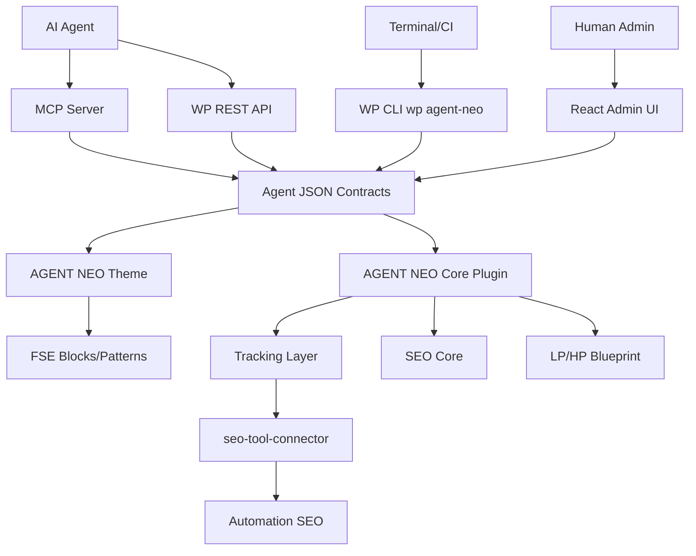
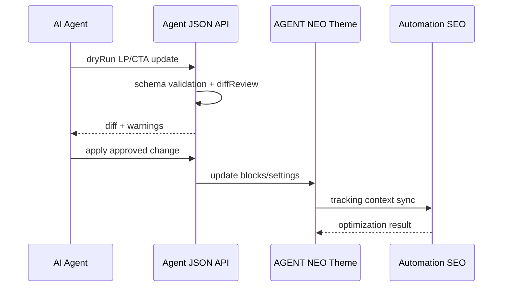
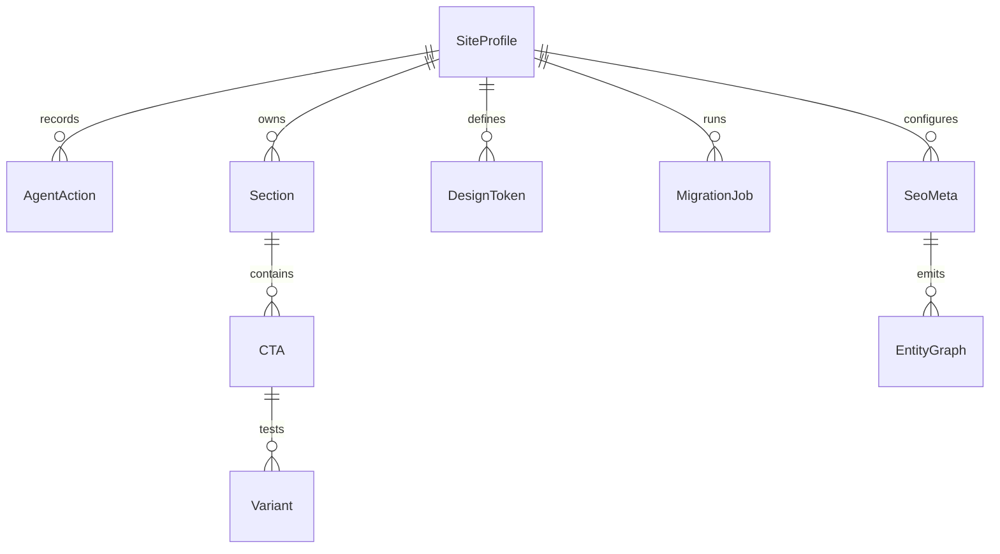

# L2 基本設計書 — AGENT NEO

## 1. 概要

### 1.1 目的

AGENT NEO は、WordPress FSEテーマをAIエージェントが安全に操作できるようにする商用テーマ基盤である。人間向けGUIに加えて、REST API、MCP、WP CLIを同一JSON契約で提供し、記事生成、LP改善、CTA/A-Bテスト、計測、移行をAutomation SEOと連携して実行する。

### 1.2 スコープ

| 区分 | 内容 |
|---|---|
| 対象 | Coreテーマ、個人版、法人版、移行プラグイン、Automation SEO連携 |
| 対象外 | 参照テーマのコード/画像/CSS流用、初版での完全MA内蔵、WordPress.com保証 |

### 1.3 前提条件・制約

- WordPress 6.6+ / PHP 8.1+
- FSE / theme.json / block.json 中心
- GPL互換
- Theme CoreはFSE表示層、Companion PluginはAPI/CPT/SEO/計測/A-B/Blueprint層に分離
- Automation SEO / seo-tool-connector の既存APIと整合
- テーマ本体は買い切り、Automation SEOは別課金

## 2. アーキテクチャ

### 2.1 システム構成図



### 2.2 技術スタック

| レイヤー | 技術 | バージョン | 選定理由 |
|---|---|---:|---|
| CMS | WordPress | 6.6+ | 国内導入済みサイトへの到達性 |
| Runtime | PHP | 8.1+ | WPテーマ互換と保守性 |
| Theme | FSE / theme.json / block.json | WP標準 | AI操作しやすい宣言的構造 |
| Admin UI | React / WP components | WP同梱基盤 | 管理画面との親和性 |
| API | WP REST API | WP標準 | Automation SEO連携 |
| CLI | WP CLI | 最新安定 | terminal/CI/AI操作面 |
| AI連携 | MCP | 初版同梱 | Claude/MCPクライアント連携 |
| Tracking | seo-tool-connector | 既存 v1.1.0 | CTA/A-B/section計測の既存資産活用 |

### 2.3 ADR

| ADR | 決定 | 理由 |
|---|---|---|
| ADR-001 | FSEテーマとして実装 | block/theme JSONとAI操作の相性が高い |
| ADR-002 | 4操作面を同一JSON契約に集約 | REST/MCP/WP CLI/UIの実装重複を防ぐ。`catalog-update` の外部push契約は ADR-012 + §2.4 の範囲で扱う |
| ADR-003 | Automation SEOは別課金 | AI原価をテーマ買い切り価格に抱え込まない |
| ADR-004 | 参照テーマは設計抽象のみ取り込む | ライセンス/著作権リスクを避ける |
| ADR-005 | SEOはJIN:R型の統合UXを採用 | AIがSEOメタ/OGP/canonical/noindex/schemaを一括操作できるようにする |
| ADR-006 | 速度設計はSWELL型の条件付きアセット戦略を採用 | JIN:RはSEO統合に強いが、速度基盤はSWELLのCSS分割/遅延読み込み/不要機能抑制を優先する |
| ADR-007 | LPとHPは別ブループリントとして設計 | LPはCV獲得、HPはブランド/回遊ハブで成功指標が違うため |
| ADR-008 | Theme CoreとCompanion Pluginを分離 | WordPress.orgのplugin territory、データ移植性、審査リスク、保守性を守るため |
| ADR-009 | Theme本体はSWELL型の薄いbootstrapとmodule分割を採用 | `functions.php`肥大化を避け、FSE/theme.json/block.json/条件付きassetを正本にするため |
| ADR-010 | デザインは見た目コピーではなく失敗しにくいUI思想を契約化 | SWELLの情報設計とJIN:RのプリセットUXをAI改善可能なdesign contractに変換するため |
| ADR-011 | 運用品質をJSON契約化 | WP更新、プラグイン追加、外部連携障害、セキュリティ設定をHealth/Update/Conflict/Fallbackで診断可能にするため |
| ADR-012 | API/自動化は契約ファーストでCore Pluginが所有 | Theme本体にCron/API状態を持たせず、OpenAPI/JSON Schema/Job ContractでREST/MCP/WP CLI/Cronを同一仕様にするため |
| ADR-013 | AI運用性とクローラビリティを製品契約にする | 既存テーマは人間GUI前提で、AIが安全に読む/触る/公開可否を判断する機械契約が不足しているため |
| ADR-014 | テーマ品質/配布準備をP0契約にする | 商用テーマは機能だけでなく、Theme Review、a11y、i18n、release、SBOM、host互換、privacy、SEO indexing、support docsの証跡が販売信頼と保守性に直結するため |
| ADR-015 | LLMOをSEO Coreの拡張ではなく独立契約にする | AI検索ではindexだけでなく、引用、根拠、学習可否、AI入力可否、AI経由CV計測が必要で、通常SEOメタだけでは表現できないため |
| ADR-016 | SEO/WP運用の不都合な真実をrisk-ledgerとして製品化する | canonical/noindex、WP-Cron、cache、plugin conflict、update/rollback、privacy、AI snapshotの静かな事故を検出・復旧対象にするため |
| ADR-017 | 市場カテゴリをAI運用型WPテーマ基盤として定義する | 既存テーマのデザイン/SEO/価格競争に正面衝突せず、AI操作、LP改善、計測、LLMO、運用品質を中核価値にするため |
| ADR-018 | Automation SEO連携はAGENT NEO契約を正規ターゲットにする | SWELL/JIN:Rは移行・診断・設計参考に限定し、運用時はstable section/CTA/SEO契約とsafe applyを持つAGENT NEOへ集約するため |
| ADR-019 | Automation SEO Theme Bridge Pluginは診断・正規化・移行入口に限定する | 既存テーマのDOM/CSS/SEOメタは安定APIではないため、深い自動書き換えではなくsource/confidence付き情報契約として扱う |

### 2.4 配布境界

| 配布物 | 責務 | 持たせないもの |
|---|---|---|
| `agent-neo-theme` | `theme.json`、templates、parts、patterns、style variations、表示CSS | CPT、SEO保存、計測保存、フォーム処理、AI操作API、構造データ永続化 |
| `agent-neo-core-plugin` | REST/MCP/WP CLI、CPT、custom blocks、SEO Core、Tracking/A-B、LP/HP Blueprint、License gate、`SiteProfile`/`AgentAction`/`Section`/`post_meta` の構造データ管理、`catalog-update` 発火 | 見た目だけのテーマスタイル責務 |
| `agent-neo-migration-plugin` | WP REST抽出、変換プレビュー、S1ハンドオフ | 無制限AI再構築、テーマ別専用アダプタ乱立 |
| Automation SEO | AI生成、IA/SEO再設計、改善提案 | テーマ買い切り価格へのAI原価内包 |

### 2.5 プラグイン依存度

AGENT NEOの必須依存は `agent-neo-theme` と `agent-neo-core-plugin` に限定する。外部プラグインは依存先ではなく、検出・共存・adapter連携の対象として扱う。

| レベル | 対象 | 依存度 | 方針 |
|---|---|---:|---|
| D0 | WordPress / PHP | 必須 | WP 6.6+ / PHP 8.1+ |
| D1 | `agent-neo-theme` | 必須 | FSE表示層 |
| D2 | `agent-neo-core-plugin` | 実質必須 | JSON API、MCP、WP CLI、CPT、SEO、計測、A/B、Blueprint |
| D3 | `agent-neo-migration-plugin` | 任意 | 移行時のみ。通常運用に必須化しない |
| D4 | `seo-tool-connector` | 推奨 | Automation SEO連携。未導入時はローカル軽量計測へfallback |
| D5 | Automation SEO | 有料外部依存 | AI生成/IA再設計。テーマの通常動作には必須化しない |
| D6 | Yoast / Rank Math等 | 任意共存 | 重複meta/schemaを検出して抑制 |
| D7 | フォーム/CRM系 | 任意adapter | 外部フォームCTAとして扱う |
| D8 | キャッシュ/高速化系 | 任意共存 | テーマはasset policyを持つがcache engineを持たない |
| D9 | GA4/GTM/広告タグ | 任意同意制 | third-party tag governanceで管理 |
| D10 | Automation SEO Theme Bridge Plugin | 任意/推奨 | 既存テーマの診断・正規化・移行入口。AGENT NEOではCore Pluginが正規write target |

## 3. 機能設計

### 3.1 機能一覧

| ID | 機能名 | 概要 | 対応要件 | 優先度 |
|---|---|---|---|---|
| F-001 | Theme Kernel | FSEテーマの起動、feature flags、package判定 | REQ-F-001 | P0 |
| F-002 | Agent JSON API | dryRun、schema validation、diffReview付きJSON操作 | REQ-F-002 | P0 |
| F-003 | Operation Surfaces | REST/MCP/WP CLI/React UI | REQ-F-003 | P0 |
| F-004 | Affiliate Blocks | Review、Ranking、Comparison、Affiliate CTA | REQ-F-004 | P0 |
| F-005 | Corporate LP Builder | Hero、Feature、Pricing、FAQ、CTA | REQ-F-005 | P0 |
| F-006 | Tracking/A-B | section_id、cta_id、variant_idで計測 | REQ-F-006 | P0 |
| F-007 | Automation SEO Adapter | seo-tool-connectorとの同期 | REQ-F-007 | P0 |
| F-008 | Migration Plugin | 既存WPから抽出/変換/投入 | REQ-F-008 | P1 |
| F-009 | Settings IO | JSON export/import | REQ-F-009 | P1 |
| F-010 | Package/Licensing | 個人/法人/アドオン境界制御 | REQ-F-010 | P1 |
| F-011 | SEO Core | SEOメタ、OGP、canonical、noindex、Entity Graphを統合管理 | REQ-F-011 | P0 |
| F-012 | LP/HP Blueprint Builder | LP/HPを別JSON契約で生成し、section_id付きのHero/Gateway/Proof/CTAを管理 | REQ-F-012 | P0 |
| F-013 | Compliance Guard | ライセンス、PR表記、外部送信同意、plugin territory、SEO保証禁止を検証 | REQ-NF-008/REQ-NF-009 | P0 |
| F-014 | Plugin Dependency Manager | 外部プラグイン検出、capability map、adapter、conflict rule、fallbackを管理 | REQ-NF-010 | P0 |
| F-015 | Theme Coding Standard | WPCS、薄いbootstrap、block.json正本、context escape、schema sanitize、used block assetを規約化 | REQ-NF-011 | P0 |
| F-016 | Design UI System | design preset、visual composition、section pattern、trust layer、UI auditを提供 | REQ-NF-012 | P0 |
| F-017 | Ops/Security Health | compatibility matrix、update preflight/postflight、security baseline、plugin conflict、availability fallbackを提供 | REQ-NF-013 | P0 |
| F-018 | Automation/API Contract | OpenAPI、JSON Schema、job/event/webhook contract、error catalog、contract testsを提供 | REQ-NF-014 | P0 |
| F-019 | AI Agent Operability | stable DOM anchor、content snapshot、crawler access matrix、SEO risk diff、AI crawler logを提供 | REQ-NF-015 | P0 |
| F-020 | Theme Quality Governance | Theme Review、a11y、i18n/RTL、release/SBOM、hosting、privacy retention、SEO indexing、support docs、QA matrixを品質ゲートとして管理 | REQ-NF-016 | P0 |
| F-021 | LLMO Governance | answer unit、evidence graph、content origin、AI visibility policy、citation anchor、LLMO計測、claim riskを管理 | REQ-NF-017 | P0 |
| F-022 | SEO & Ops Risk Ledger | canonical/noindex/robots/sitemap、cache、cron、plugin conflict、update/privacy/AI snapshotの危険変更をrisk-ledgerで管理 | REQ-NF-018 | P0 |
| F-023 | Automation SEO Fit Manager | theme capability scan、section ID resolver、Context Contract v2、SEO meta normalizer、CTA/Offer mapper、safe recommendation applyを管理 | REQ-NF-019 | P0 |
| F-024 | Automation SEO Theme Bridge | 既存テーマ横断のsite/theme/plugin/page/section/CTA/offer/SEO/tracking/privacy/health/safe apply/migration blueprint情報をsource/confidence付きで管理 | REQ-NF-020 | P0 |


### 3.3 L1要件トレーサビリティ表

| 要件ID | 要件名(短縮) | L2対応箇所(F-ID/ADR/§/API/画面/risk) | ステータス |
|---|---|---|---|
| REQ-F-001 | FSEテーマ基盤 | F-001 / A-001 / §5 / §3.1 | 設計済み |
| REQ-F-002 | JSON操作API | F-002 / A-002・A-003 / `POST /posts` / `POST /actions/dry-run` / `POST /actions/apply` | 設計済み |
| REQ-F-003 | 4操作面 | F-003 / A-004 / S-002 / 6.1 | 設計済み |
| REQ-F-004 | 個人版収益化ブロック | F-004 / A-005 / S-003 / §5 | 設計済み |
| REQ-F-005 | 法人HP/LP/BLP三位一体 | F-005 / A-006 / S-004・S-009 / §8.3 | 設計済み |
| REQ-F-006 | 計測/A-B/CTA | F-006 / A-007 / A-007 / `POST /tracking/event` / §8.1 | 設計済み |
| REQ-F-007 | Automation SEO連携（core同期） | F-007 / A-008 / F-023 / §8.12 | 設計済み |
| REQ-F-008 | 移行プラグイン | F-008 / A-009 / S-006 / §5 | 設計済み |
| REQ-F-009 | 設定エクスポート/インポート | F-009 / A-010 / §2.3・§8.9 / `POST /settings/export` | 設計済み |
| REQ-F-010 | ライセンス/パッケージ制御 | F-010 / A-011 / ADR-008 / 6.1 | 設計済み |
| REQ-F-011 | SEO Core | F-011 / A-012 / S-008 / §8.2 | 設計済み |
| REQ-F-012 | LP/HP/BLPブループリント | F-012 / A-013 / S-009 / `POST /pages/blueprint` | 設計済み |
| REQ-F-013 | 法人版リード獲得 | F-005 / F-016 / S-009 / `POST /pages/{id}/apply` | carry（L3: フォーム/フォーム連携UI詳細） |
| REQ-F-014 | 法人版顧客行動管理 | F-017 / 8.11 / S-013 / F-014 | carry（L3: 行動分析ルール） |
| REQ-F-015 | CRM/MA連携アドオン | F-018 / 7.3 / S-015 / `CRMアダプタ契約` | carry（L3: CRM適配線） |
| REQ-F-016 | 個人版テンプレ固定構成 | F-010 / F-005 / S-007 / ADR-008 | carry（L3: 固定テンプレ変更制約） |
| REQ-F-017 | 画像変換パイプライン | §8.1 / `asset-policy.schema.json` / `media-policy.schema.json` / `POST /media/upload` / S-005 | 設計済み |
| REQ-F-018 | SNS連携基盤（phase2含む） | F-004 / §7.1 / §8.2 / S-005 | Phase2 |
| REQ-F-019 | 法人版SNS深い統合 | F-004 / §7.3 / F-019 | carry（L3: LINE/utm/リファラ統合仕様） |
| REQ-F-020 | SNS API認証情報管理 | 7.3 / F-010 / ADR-008 / S-007 | carry（L3: OAuth鍵管理） |
| REQ-F-021 | 部分更新性 | F-002 / `PATCH /posts/{id}/blocks/{block_id}` / `SectionRegistry` | 設計済み |
| REQ-F-022 | H2単位LLM編集 | F-002 / `POST /posts/{id}/sections/{section_id}/edit` / S-002 | 設計済み |
| REQ-F-023 | 要素差し替えAPI | F-002 / `POST /elements/swap` / F-007 / S-005 | 設計済み |
| REQ-F-024 | AI自律A/B テスト機構 | F-006 / A-007 / S-005 / §8.6 | 設計済み |
| REQ-F-025 | JSON統一データモデル | F-002 / F-009 / §5 / A-012 | 設計済み |
| REQ-F-026 | v2連携最適化API | F-002 / A-014 / `GET /posts` / `PATCH /batch` / `GET /posts/{id}/diff`（inbound pull）※`catalog-update`/`REQ-F-044` の outbound push 責務は別責務 | 設計済み（CARRY-G2-022） |
| REQ-F-027 | v2 DBスキーマ直接マッピング | ADR-002 / §4 / A-008 / api-catalog | carry（L3: DB同一射対応） |
| REQ-F-028 | 拡張性保証（schema versioning） | ADR-012 / ADR-002 / F-018 / §5 | 設計済み |
| REQ-F-029 | ページタイプ別アセット分離 | §8.1 / ADR-006 / `asset-policy.schema.json` | 設計済み |
| REQ-F-030 | 個人版CV寄与モジュール | F-004 / §8.4 / S-005 | carry（L3: 個人版モジュール実装） |
| REQ-F-031 | 法人版CV寄与モジュール | F-004 / F-005 / S-005 / §8.4 | carry（L3: 法人特化CVモジュール） |
| REQ-F-032 | AI主導CV最適化（配信） | F-006 / F-019 / ADR-018 / §8.10 | 設計済み |
| REQ-F-033 | CV設計監査機能 | F-016 / `ui-risk.schema.json` / S-010 | 設計済み |
| REQ-F-034 | 認知バイアスパターンライブラリ | F-016 / `section-pattern.schema.json` / S-011 / `trust-layer.schema.json` | 設計済み |
| REQ-F-035 | AIフリーフォームHTML/CSS | F-016 / 8.4 / S-010 | carry（L3: フリーフォーム権限/履歴） |
| REQ-F-036 | AIHTML/CSS検証パイプライン | 7.2 / 7.3 / F-015 / F-035 | carry（L3: sanitize/axeの閾値） |
| REQ-F-037 | SlotベースBlueprint制約 | F-016 / §4 / §8.3 / `section-pattern.schema.json` | carry（L3: slot詳細設計） |
| REQ-F-038 | サンドボックスTier1 | F-011 / §8.8 / `POST /pages/{id}/preview` / `POST /pages/{id}/apply` | 設計済み |
| REQ-F-039 | サンドボックスTier2 | §8.12 / F-023 / `PATCH /batch` / §10 | carry（L3: multi-version運用） |
| REQ-F-040 | Write Authority Lock | 7.2 / §8.6 / ADR-018 / S-004 | carry（L3: ロック切替フロー） |
| REQ-F-041 | 記事編集経路 | F-002 / 7.1 / 3.2 / 6.1 | 設計済み |
| REQ-F-042 | 外部エディタアクセス制御 | 7.1 / 7.2 / ADR-019 / §8.7 | 設計済み |
| REQ-F-043 | Open Editor Bridge Plugin | 8.13 / §7.3 / ADR-019 / S-015 | carry（L3: サブスク課金運用） |
| REQ-F-044 | catalog-update発火 | ADR-002 / ADR-012 / ADR-008 / ADR-018 / `POST /aseo/v1/agent-neo/catalog-update` / §8.7 / api-catalog external outbound contracts（失敗時は §8.7 outbox/DLQ 経路で回復） | 設計済み |
| REQ-NF-001 | 性能（総則） | §8.1 / `performance-profile.json` / `web-vitals-budget.json` | 設計済み |
| REQ-NF-002 | セキュリティ | 7.1 / 7.2 / S-001 / A-014 | 設計済み |
| REQ-NF-003 | ライセンス | 7.1 / ADR-004 / F-013 / §8.9 | 設計済み |
| REQ-NF-004 | データ保護 | 7.3 / §7.1 / §8.9 / `privacy-retention-policy.json` | 設計済み |
| REQ-NF-005 | アクセシビリティ | §8.4 / §8.9 / F-015 / §8.9 | 設計済み |
| REQ-NF-006 | 国際化 | 6.1 / 7.1 / `i18n-profile.json` / F-016 | 設計済み |
| REQ-NF-007 | 可観測性 | 8.5 / `AgentAction log` / `GET /logs` | 設計済み |
| REQ-NF-008 | 配布/機能境界 | F-013 / ADR-008 / §7.1 / §8.6 | 設計済み |
| REQ-NF-009 | 法令/表示ガード | F-013 / §7.3 / `LicenseComplianceGuard` | 設計済み |
| REQ-NF-010 | プラグイン依存度管理 | F-014 / F-017 / §8.6 / plugin-conflict-rules.json | 設計済み |
| REQ-NF-011 | テーマコーディング規約 | F-015 / §7.1 / theme-review-checklist / PHPCS | 設計済み |
| REQ-NF-012 | デザイン/UI思想 | F-016 / §8.4 / `design-preset.schema.json` / `visual-composition.schema.json` | 設計済み |
| REQ-NF-013 | 運用品質 | F-017 / §7.3 / 8.11 / quality-gate-result.schema.json | 設計済み |
| REQ-NF-014 | API/自動化契約 | F-018 / §8.7 / A-014 / `openapi.yaml` | 設計済み |
| REQ-NF-015 | AI運用性/クローラビリティ | F-019 / §8.8 / `agent-operability.schema.json` / `dom-anchor.schema.json` | 設計済み |
| REQ-NF-016 | テーマ品質/配布準備 | F-020 / 8.9 / `theme-review-checklist.json` / quality gate | 設計済み |
| REQ-NF-017 | LLMO/AI検索最適化 | F-021 / §8.10 / `evidence-graph.schema.json` / `citation-anchor.schema.json` | 設計済み |
| REQ-NF-018 | SEO/WP運用ハザード管理 | F-022 / 8.11 / `risk-ledger.schema.json` / ADR-016 | 設計済み |
| REQ-NF-019 | Automation SEO適合性 | F-023 / 8.12 / `theme-capability.schema.json` | 設計済み |
| REQ-NF-020 | Theme Bridge情報設計 | F-024 / 8.13 / `site_profile` / `migration_blueprint` | 設計済み |
| REQ-NF-001a | JS予算 | §8.1 / `asset-policy.schema.json` / `web-vitals-budget.json` | 設計済み |
| REQ-NF-001b | Core Web Vitals必達 | §8.1 / `web-vitals-budget.json` / §7.3（品質ゲート） | 設計済み |
| REQ-NF-001c | CV直結評価 | F-001 / 6.1 / `§1`（価値検証） | 設計済み |
| REQ-NF-001d | 画像メディアポリシー | §8.1 / 7.3 / §5.2（公開契約） | 設計済み |
| REQ-NF-001e | JS採用時の性能担保 | §8.1 / 7.2 / `media-policy.schema.json` | 設計済み |
| REQ-NF-001f | ページタイプ別性能予算 | §8.1 / `asset-policy.schema.json` / 7.3 | 設計済み |
| REQ-NF-021 | 非AIユーザビリティ | 6.1 / F-001 / 6.2 | 設計済み |
| REQ-NF-022 | 日本語UI / 段階的開示 | 6.1 / `i18n-profile.json` / `Design UI System` | 設計済み |
| REQ-NF-023 | AI機能オプトイン強制 | 7.3 / 6.1 / 8.6 / 6.2 | 設計済み |
| REQ-NF-024 | 外部API規約監査 | 8.13 / 7.3 / F-013 / `plugin-conflict-rules.json` | carry（L3: TOS監査運用） |
| REQ-NF-025 | AIロジック完全分離原則 | §8.10 / 8.8受信ペイロード / api-catalog / ADR-018 | 設計済み |
| 合計 |  | 設計済み: 58 / Phase2: 1 / carry: 16 / 未設計: 0 | 設計済み |

### 3.2 ユーザーフロー



## 4. データモデル

### 4.1 主要エンティティ

| エンティティ | 概要 | 主要属性 | 概算レコード数 |
|---|---|---|---:|
| SiteProfile | サイト/ライセンス/連携情報（AGENT NEO Core Plugin 所有） | site_id, package, license_status | 1/site |
| AgentAction | AI操作ログ | action_id, actor, dry_run, status, diff | 操作数分 |
| Section | 記事/LP内セクション | section_id, article_id, type, order | ページ数 x セクション |
| CTA | CTA定義 | cta_id, label, url, variant_ids | 数十〜数百 |
| Variant | A/Bテストvariant | variant_id, cta_id, weight | CTA x variant |
| DesignToken | ブランド/デザイン値 | color, spacing, typography, radius | packageごと |
| MigrationJob | 移行ジョブ | job_id, source_url, status, preview_diff | 移行数分 |
| SeoMeta | 投稿/LP/分類SEO | target_type, target_id, title, description, canonical, robots, ogp | 投稿/LP/分類数分 |
| EntityGraph | JSON-LD構造 | entity_id, target_id, entity_type, graph_json | ページ数 x Entity |

※ `site_id`/`site_token` は `agent-neo-core-plugin` が保持し、`wp_options.agent_neo_site_id` / `wp_options.agent_neo_site_token`（`site_token` は暗号化保存）へ永続化する。`agent-neo-core-plugin` が投稿データを保有し、`wp_posts.ID`/`_agent_neo_*` 系 post_meta/`SITES` を介して整合する。

### 4.2 ER図



※ ER図の `FK` は実装上の物理外部キー制約を意味しない。`SiteProfile` 参照は `wp_options`/`v2 SITES`/`post_meta` で整合確認する論理参照運用。

## 5. API概要設計

| ID | メソッド | パス | 概要 | 認証 | 対応機能 |
|---|---|---|---|---|---|
| A-001 | GET | `/wp-json/agent-neo/v1/status` | テーマ/ライセンス/連携状態 | 要 | F-001 |
| A-002 | POST | `/wp-json/agent-neo/v1/actions/dry-run` | JSON操作の検証 | 要 | F-002 |
| A-003 | POST | `/wp-json/agent-neo/v1/actions/apply` | JSON操作の適用 | 要 | F-002 |
| A-004 | GET | `/wp-json/agent-neo/v1/contracts` | block/layout/component契約取得 | 要 | F-003 |
| A-005 | POST | `/wp-json/agent-neo/v1/affiliate/block` | 収益化ブロック生成 | 要 | F-004 |
| A-006 | POST | `/wp-json/agent-neo/v1/lp/sections` | LPセクション生成/更新 | 要 | F-005 |
| A-007 | POST | `/wp-json/agent-neo/v1/tracking/event` | 計測イベント受付 | 条件付き | F-006 |
| A-008 | POST | `/wp-json/agent-neo/v1/tracking/context` | Automation SEO互換context送信 | 要 | F-007 |
| A-009 | POST | `/wp-json/agent-neo/v1/migration/jobs` | 移行ジョブ作成 | 要 | F-008 |
| A-010 | POST | `/wp-json/agent-neo/v1/settings/export` | 設定export | 要 | F-009 |
| A-011 | POST | `/wp-json/agent-neo/v1/license/validate` | ライセンス検証 | 要 | F-010 |
| A-012 | POST | `/wp-json/agent-neo/v1/seo/meta` | SEOメタ/Entity Graph更新 | 要 | F-011 |
| A-013 | POST | `/wp-json/agent-neo/v1/pages/blueprint` | LP/HP blueprint生成・更新 | 要 | F-012 |
| A-014 | POST | `/wp-json/agent-neo/v1/jobs` | 自動化job作成 | 要 | F-018 |
| A-015 | GET | `/wp-json/agent-neo/v1/jobs/{job_id}` | job状態/結果取得 | 要 | F-018 |
| A-016 | POST | `/wp-json/agent-neo/v1/jobs/{job_id}/cancel` | job取消 | 要 | F-018 |
| A-017 | GET | `/wp-json/agent-neo/v1/health` | REST/Cron/loopback/external API診断 | 要 | F-017/F-018 |
| A-018 | GET | `/wp-json/agent-neo/v1/public/pages/{id}/snapshot` | 公開ページのAI Snapshot取得 | 不要/公開 | F-019 |
| A-019 | GET | `/wp-json/agent-neo/v1/public/crawl-map` | 公開ページのcrawl map取得 | 不要/公開 | F-019 |
| A-020 | POST | `/wp-json/agent-neo/v1/crawler-policy` | crawler access matrix更新 | 要 | F-019 |
| A-021 | GET | `/wp-json/agent-neo/v1/public/llmo/answers` | 公開answer unit、citation anchor、evidence graph取得 | 不要/公開 | F-021 |
| A-022 | GET | `/wp-json/agent-neo/v1/risks/hazards` | SEO/WP運用/AI運用のrisk-ledgerと検出結果を取得 | 要 | F-022 |
| A-023 | GET/POST | `/wp-json/agent-neo/v1/automation-seo/fit` | theme capability、section/CTA/SEO mapping、safe apply readinessを診断/同期 | 要 | F-023 |
| A-024 | GET | `/wp-json/agent-neo/v1/automation-seo/bridge-profile` | Theme Bridge Plugin互換のsite/theme/plugin/page/section/CTA/offer/SEO/tracking/privacy/health/migration情報を取得 | 要 | F-024 |

## 6. 画面設計

### 6.1 画面一覧

| ID | 画面名 | 概要 | 対応機能 | 備考 |
|---|---|---|---|---|
| S-001 | Dashboard | 状態、接続、計測概要 | F-001 | Core |
| S-002 | Agent Actions | dryRun、差分、操作ログ | F-002/F-003 | Core |
| S-003 | Affiliate Builder | 比較/ランキング/CTA管理 | F-004 | 個人版 |
| S-004 | LP Builder | セクション編集、Pricing、CTA | F-005 | 法人版 |
| S-005 | Tracking | CTA/A-B/section計測 | F-006/F-007 | 法人版優先 |
| S-006 | Migration | 抽出、プレビュー、投入 | F-008 | プラグイン |
| S-007 | License/Package | 個人/法人/アドオン状態 | F-010 | Core |
| S-008 | SEO Core | title/description/robots/canonical/OGP/schema管理 | F-011 | Core |
| S-009 | LP/HP Builder | LP/HP blueprint、section、CTA、Proof、Gateway管理 | F-012 | 法人版優先 |
| S-010 | AI Operability | DOM anchor、snapshot、crawler policy、AI crawler log、SEO risk diff | F-019 | Core |
| S-011 | Quality Governance | Theme Review Gate、Accessibility Gate、i18n/RTL Gate、Release/SBOM Gate、Hosting Compatibility Gate、Privacy Retention Gate、SEO Indexing Gate、Documentation Support Gateの結果を表示 | F-020 | Core |
| S-012 | LLMO Visibility | answer unit、evidence、AI visibility policy、citation、AI経由CVを表示 | F-021 | Core |
| S-013 | Risk Ledger | SEO/WP運用/AI運用のハザード、検出結果、対策状況を表示 | F-022 | Core |
| S-014 | Automation SEO Fit | theme scan、section ID confidence、SEO meta normalization、CTA/Offer mapping、safe apply readinessを表示 | F-023 | Core |
| S-015 | Theme Bridge Profile | 既存テーマ横断の診断情報、保持情報、preview-only/write-ready判定、移行blueprintを表示 | F-024 | Core |

### 6.2 情報設計

```text
AGENT NEO Admin
├── Dashboard
├── Agent Actions
│   ├── Dry Run
│   ├── Diff Review
│   └── Logs
├── Design Tokens
├── Affiliate Builder
├── LP Builder
├── Tracking
├── Migration
├── SEO Core
├── LP / HP Builder
├── AI Operability
├── Quality Governance
├── LLMO Visibility
├── Risk Ledger
├── Automation SEO Fit
├── Theme Bridge Profile
└── License / Package
```

## 7. セキュリティ設計

### 7.1 脅威分析（STRIDE）

| 脅威カテゴリ | 脅威シナリオ | 影響度 | 対策 |
|---|---|---|---|
| Spoofing | AI/API利用者のなりすまし | 高 | nonce、capability、application password/OAuth候補 |
| Tampering | JSON操作で不正HTML/JS挿入 | 高 | schema validation、sanitize、allowlist |
| Repudiation | 誰が変更したか不明 | 中 | AgentAction監査ログ |
| Information Disclosure | 設定/ライセンス情報の漏洩 | 高 | 権限分離、秘匿値マスク |
| Denial of Service | 計測API大量送信 | 中 | rate limit、bot filter |
| Elevation of Privilege | 個人版で法人機能を有効化 | 中 | package gate、license validation |

### 7.2 認証・認可設計

- REST書き込み: WordPress nonce + capability check
- MCP: ローカル実行前提でも操作対象をallowlist化
- WP CLI: 管理者権限/サーバー権限前提、dangerous operationはconfirm/dryRun必須
- React UI: WordPress管理者権限に従う
- 計測イベント: 公開受付が必要なものは署名/nonce相当/rate limitで保護
- HMAC キー・鍵ローテーションの運用規約: 旧鍵は `catalog-update` 受信のみに限定し、`F-01` 以外の operation では旧鍵を受け付けない

### 7.3 AI/法令/配布ガード

| ガード | 対象 | 設計 |
|---|---|---|
| LicenseComplianceGuard | 第三者素材、参照テーマ、minified資産 | 依存一覧、元ソース、GPL互換、コピー禁止をレビュー対象にする |
| ThemePluginBoundaryGuard | CPT、SEO保存、計測、A/B、フォーム | Theme Coreへの混入を禁止し、Companion Pluginへルーティングする |
| PrivacyConsentGuard | Automation SEO、GA4/GTM、CRM、広告タグ | 初期無効、opt-in、privacy policy template、外部送信データマップを必須化 |
| AffiliateDisclosureGuard | レビュー、ランキング、比較、CTA | PR表記、根拠、検証日、source_urlを必須化する |
| AiWriteSafetyGuard | JSON書き込み、MCP、WP CLI | dryRun、diffReview、rollback、schema versioning、audit logを必須化する |
| PluginDependencyGuard | SEO/フォーム/キャッシュ/計測系プラグイン | 必須依存化を禁止し、detect/capability map/adapter/fallbackで扱う |

## 8. 非機能設計

### 8.1 性能設計

- ブロック別CSS/JSを条件付き読み込み
- LP/記事で未使用の計測コードを出さない
- 画像lazy loadと不要jQuery依存の回避
- 動的CSSはdesign tokensからCSS変数へ集約
- Core Web Vitals予算は LCP `2.5s` 以下、INP `200ms` 以下、CLS `0.1` 以下にする
- `performance-profile.json`、`asset-policy.schema.json`、`media-policy.schema.json`、`web-vitals-budget.json` をL3で契約化する
- LCP画像は eager/preload/fetchpriority を制御し、初期表示外画像とiframeはlazy化する
- GA4/GTM/広告/CRM/外部フォームは第三者タグポリシーで遅延、同意、ページ条件付きにする
- 第三者タグは同意後に `async/defer` で非同期読込するため、`render blocking third-party: 0` と矛盾しない
- フロントjQueryは初期状態で無効。互換機能が必要な場合のみfeature flagで条件付き読み込みする

| 速度予算 | 目標 |
|---|---:|
| 初期CSS | `20KB gzip` 以下 |
| route CSS | `50KB gzip` 以下 |
| 初期JS | `70KB gzip` 以下 |
| render blocking third-party | `0` |
| フォント | 2 family / 3 weights以内 |

### 8.2 SEO設計

AGENT NEOはJIN:R型の統合SEO UXを採用し、SWELL型のJSON-LD品質とSEOプラグイン共存性を組み合わせる。

| コンポーネント | 責務 |
|---|---|
| SeoProfileRepository | サイト/組織/著者/SNS/ロゴ設定の保存・取得 |
| SeoMetaRepository | 投稿/LP/分類ごとのtitle、description、robots、canonical、OGP保存 |
| EntityGraphBuilder | ページ文脈からJSON-LD `@graph` を構築 |
| SeoConflictDetector | SEOプラグイン・重複meta・重複JSON-LDを検知 |
| SeoValidationService | schema.org必須項目、URL、画像、robots、canonicalを検証 |
| SeoActionController | REST/MCP/WP CLI/UIから同一操作を受付 |
| AutomationSeoAdapter | Automation SEOからのメタ提案、Entity提案、改善指示を反映 |

### 8.3 LP/HP設計

AGENT NEOは、LPを「1オファーのCV獲得ページ」、HPを「ブランド/回遊/信頼のハブ」として分ける。LP/HPとも `section_id` を必須にし、Automation SEOがセクション単位で改善できるようにする。

| Blueprint | 主目的 | 標準セクション |
|---|---|---|
| `lp-blueprint` | 問い合わせ、資料DL、購入、ASPクリック | Hero、Problem、Agitation、Solution、Feature、Benefit、Use Case、Proof、Comparison、Pricing、FAQ、Final CTA |
| `home-blueprint` | ブランド理解、カテゴリ回遊、主要導線 | Brand Hero、Gateway Grid、Product Overview、Case Studies、Resources、Trust、Final CTA |
| `affiliate-landing-blueprint` | 比較/レビューからASPクリック | Lead Hero、Best Pick、Ranking、Comparison Table、Review Detail、FAQ、Affiliate CTA |
| 補足 | `lp-blueprint`は12セクションを採用（`Hero, Problem, Agitation, Solution, Feature, Benefit, Use Case, Proof, Comparison, Pricing, FAQ, Final CTA`）。`Consequence` は除去し `Agitation` に集約、`home-blueprint` / `affiliate-landing-blueprint`は7セクション定義で、api-catalog の `lp-blueprint=12` と分離管理で整合する（INT-001 / CARRY-G2-012） |

| コンポーネント | 責務 |
|---|---|
| PageBlueprintRepository | LP/HP blueprintの保存・取得 |
| SectionRegistry | セクション種別、variant、必須フィールドを定義 |
| ConversionPathService | cta_id、offer_id、form、資料DL、ASPリンクを管理 |
| ProofRepository | 導入事例、実績数値、レビュー、ロゴを管理 |
| PageActionController | REST/MCP/WP CLI/UIからblueprint生成・差分更新を受付 |
| PageMeasurementAdapter | section_id、gateway_id、proof_id単位で計測イベントを送る |

### 8.4 デザイン/UI設計

AGENT NEOのデザインは、参照テーマの見た目ではなく「失敗しにくい情報設計」を取り込む。SWELLからはトップ導線、カード/タブ/CTA、記事とLPの読みやすい構造を抽象化し、JIN:Rからはファーストビュー、デザインプリセット、丸み/余白/見出しの選択UXを抽象化する。

| 契約 | 責務 |
|---|---|
| `design-preset.schema.json` | 用途別の色、フォント、角丸、余白、CTA強度を定義 |
| `visual-composition.schema.json` | Z型/F型、12カラム、視線リセット、モバイル優先配置を定義 |
| `section-pattern.schema.json` | Hero、Gateway、Proof、Comparison、Pricing、FAQ、CTAの必須構造を定義 |
| `conversion-intent.schema.json` | セクションごとの目的・CTA数・期待行動を**宣言する静的構造定義**（`hero.vague` / `proof.too_late` / `cta.overload` などのCV判定ロジックは持たない。評価結果は `ui-risk.schema.json` 受信形式で受ける） |
| `trust-layer.schema.json` | 実績、レビュー、運営者、根拠、PR表記、検証日を定義 |
| `ui-risk.schema.json` | `hero.vague`、`cta.overload`、`proof.too_late`、`affiliate.disclosure_weak` などの **Automation SEO 側で算出した UI risk 監査結果**を受け取り、表示・修正UIへ反映するための受信ペイロード |

| プリセット | 主用途 | 設計方針 |
|---|---|---|
| `affiliate-clear` | 個人アフィリエイト | 比較表、ランキング、PR表記、根拠を明快に出す |
| `affiliate-editorial` | レビュー/読み物 | 長文可読性、視線リセット、体験談と根拠を両立 |
| `corporate-trust` | BtoB/士業/実績訴求 | 信頼色、導入実績、問い合わせ導線を早い位置に置く |
| `corporate-product` | SaaS/製品LP | 課題、解決、機能、価格、FAQ、CTAを1オファーで並べる |
| `startup-bold` | 新規サービス | 強いヒーロー、数字、動画/図解、短いCTAで初速を作る |
| `local-business` | 店舗/地域ビジネス | 地域性、写真、営業時間、地図、電話CTAを優先する |

### 8.5 監視・ログ設計

| メトリクス | 閾値 | 記録先 |
|---|---:|---|
| JSON操作失敗率 | `5%` 超 | AgentAction log |
| 計測API 4xx率 | `5%` 超 | Tracking log |
| Automation SEO同期失敗 | `1件` 以上 | Admin notice/log |
| ライセンス検証失敗 | `3回` 連続 | License log |

### 8.6 運用・更新・可用性設計

AGENT NEOは、WPコア更新、PHP/DB更新、プラグイン追加、外部連携障害で壊れにくいことを製品機能として扱う。SWELL型の環境チェック、更新後処理、WPバージョン分岐を抽象化し、AGENT NEOでは更新前後チェック、ロールバック、衝突検出、fallbackまで契約化する。

| 契約 | 責務 |
|---|---|
| `compatibility-matrix.json` | WP/PHP/DB/主要プラグイン/ブラウザの対応範囲を宣言 |
| `update-policy.schema.json` | 更新チャネル、更新前診断、更新後検証、rollback条件を定義 |
| `security-baseline.schema.json` | nonce、capability、permission_callback、sanitize、escape、SSRF/XSS対策を定義 |
| `plugin-conflict-rules.json` | SEO、cache、form、security、block、analytics系プラグインの衝突を検出 |
| `availability-profile.json` | Automation SEO、seo-tool-connector、license、CRM障害時のfallbackを定義 |
| `observability-profile.json` | health check、metrics、logs、alerts、support bundleを定義 |
| `ops-runbook.schema.json` | 更新、障害、復旧、サポート提出情報の手順を定義 |

| 管理画面 | 役割 |
|---|---|
| Health | WP/PHP/DB/HTTPS/cron/REST/loopback/権限を診断 |
| Updates | 現在版、更新可能版、互換性、更新前後チェック、rollback準備を表示 |
| Security | API権限、外部送信、ログマスク、危険設定を検査 |
| Plugins | 衝突検出、adapter状態、fallback状態を表示 |
| Integrations | Automation SEO、seo-tool-connector、GA/GTM、CRMの接続状態を表示 |
| Logs | AI操作、更新、migration、計測失敗、同期失敗を確認 |
| Runbooks | 更新手順、障害対応、復旧手順を提示 |

| SLO | 目標 |
|---|---:|
| 公開ページ表示可用性 | `99.9%` |
| JSON操作成功率 | `95%+` |
| 計測イベント欠損率 | `1%` 未満 |
| 更新後fatal error | `0` |
| Critical脆弱性対応 | `24h` |
| High脆弱性対応 | `7d` |

### 8.7 API/自動化契約設計

AGENT NEOのAPIと自動化は、参照テーマで観測したREST/AJAX/Cronをそのまま移植せず、Core Plugin側の契約ファースト基盤として実装する。REST、MCP、WP CLI、React UIは同一のJSON契約を参照し、Cronや外部Webhookもjob contractに揃える。

| 契約 | 責務 |
|---|---|
| `openapi.yaml` | REST APIのendpoint、request、response、error、exampleの正本 |
| `agent-actions.schema.json` | AI操作のdryRun/apply、diff、rollback、audit logの正本 |
| `job-contract.schema.json` | job作成、状態、retry、cancel、result、idempotencyの正本 |
| `event-contract.schema.json` | tracking、section engagement、A/B eventの正本 |
| `webhook-contract.schema.json` | Automation SEO、external cron、license callbackの署名付き契約 |
| `error-catalog.json` | エラーコード、HTTP status、復旧方法の正本 |
| `mcp-tools.schema.json` | MCP toolのinput/output、権限、危険操作分類の正本 |
| `wp-cli-contract.json` | `wp agent-neo` のcommand、引数、exit code、JSON出力の正本 |
| `automation-schedule.schema.json` | schedule、runner、retry/backoff、dead letterの正本 |
| `catalog-update.schema.json` | `POST /aseo/v1/agent-neo/catalog-update` の payload / event_kind / idempotency / deduplicated 応答は `D-PLUGIN-CONTRACT §17` を互換ミラー（再定義不可） |

### External outbound contracts（AGENT NEO → automation SEO）

AGENT NEO Core Plugin（Plugin B）が producer、Automation SEO が receiver となる、外部送信契約。`D-PLUGIN-CONTRACT §17` を正本として、以下を互換実装でミラーする。AGENT NEO 側で schema を再定義しない。

| 項目 | 契約 |
|---|---|
| endpoint | `POST /aseo/v1/agent-neo/catalog-update` |
| event_kind | `block_registered` / `block_unregistered` / `template_updated` / `theme_token_updated` |
| idempotency | `event_id`（UUIDv4、リクエスト別一意、24h TTL、Redis保持）※`idempotency_key` 個別フィールドは持たない |
| response | `deduplicated=false`、`deduplicated=true`、`event_id`、`received`、`next_action` の 4 フィールドのみを返却（初回/再送とも同一） |
| validation | `event_kind` 欠落は `400 VALIDATION_ERROR` |
| error | `400 VALIDATION_ERROR`（`event_kind` 欠落を含む） / `401 PLUGIN_AUTH_FAILED` / `409 AGENT_NEO_NOT_INSTALLED` / `429 RATE_LIMITED` |

| Runner | 用途 | 方針 |
|---|---|---|
| WP-Cron | health check、tracking flush、license refreshなど低〜中重要度job | ページロード依存のため時刻保証を期待しない |
| WP CLI server cron | SEO sync、migration preview、blueprint rebuildなど高重要度job | サーバーcron/CI/terminal AIの主経路 |
| External cron/webhook | managed環境、Automation SEO連携 | HMAC署名、timestamp、replay防止を必須化 |
| Manual admin trigger | 復旧、サポート、検証 | capability、audit log、dryRunを必須化 |

| APIルール | 内容 |
|---|---|
| 名前空間 | `/wp-json/agent-neo/v1` に統一し、`wp/v2`へ独自routeを混入しない |
| 標準レスポンス | `success`、`data`、`meta.request_id`、`error.code` を統一 |
| Write安全性 | nonce/application password、capability、package scope、schema validation |
| AI apply | `dry-run`済みdiff hash、idempotency key、rollback pointを要求 |
| Public tracking | site token、signature、rate limit、PII最小化、bot filter |
| 外部URL取得 | private IP deny、redirect上限、timeout、content length上限、content-type allowlist |
| 契約検証 | OpenAPI lint/diff、JSON Schema validation、REST/MCP/WP CLI contract testをCI必須 |

| Job状態 | 遷移 |
|---|---|
| 基本 | `queued -> running -> succeeded` |
| 再試行 | `running -> failed -> retrying -> running`（対象外: 4xx（429 除外） / 401 / 409 は即 `dead_letter`） |
| 失敗固定 | `failed -> dead_letter` |
| 取消 | `queued/running -> cancelled` |

#### catalog-update 送信障害設計（ADR-012 準拠 / producer = AGENT NEO Core Plugin）

`catalog-update` は以下を前提に送信する。

- `max_attempts: 5`（初回を含む）  
- `initial_backoff_seconds: 1`、`backoff_multiplier: 2.0`、`jitter: ±10%`（指数バックオフ）  
- ネットワーク障害（`network timeout`） / Automation SEO 側 `maintenance` / 5xx / 429 は outbox 保持し再試行  
- 4xx（429 除外）・401・409 は再試行しない（`failed` 経由で `dead_letter`）  
- `failed` が上限に到達した場合は `dead_letter`（`event_id`, `reason` を保持）し、producer へ `status: 409 RETRY_EXHAUSTED` を通知（§17.11 / CARRY-G2-006）  
- 再送時も同一 `event_id` を維持し、Automation SEO 側の重複排除を前提にする。

### 8.8 AI運用性・クローラビリティ設計

AGENT NEOは、AIエージェントが「見る」「触る」「変更する」「監査する」「クローラに見せる/見せない」を安定して判断できる構造を持つ。ブラウザ自動操作は補助経路であり、正本はJSON契約、stable DOM anchor、public content snapshot、crawler access matrixに置く。

| 契約 | 責務 |
|---|---|
| `agent-operability.schema.json` | AIが触れる対象、危険度、承認要否、rollback可否を定義 |
| `dom-anchor.schema.json` | `data-agent-section-id`、`data-agent-role`、`data-cta-id`等のDOM契約 |
| `content-snapshot.schema.json` | JS操作なしに読める公開ページ構造、section、CTA、schema、robots状態 |
| `crawlability-profile.json` | indexability、robots、canonical、sitemap、AI crawler方針を管理 |
| `crawler-access-matrix.json` | crawler別にsearch、ai-input、ai-trainの許可を定義 |
| 補足 | `crawler-access-matrix.json` と `ai-visibility-policy.json` の判定キーを `search` / `ai-input` / `ai-train` / `snippet` / `WAF` で一本化し、ADR-013 と整合 |
| `ai-crawler-log.schema.json` | AI crawler access、robots violation、rate limit、WAF actionを記録 |
| `rendered-content-digest.json` | HTML、JSON-LD、snapshotの差分hashを記録 |
| `settings-intent.schema.json` | 設定値の理由、owner、期限、変更元を保持 |
| `seo-risk.schema.json` | noindex/canonical/robots/schema変更の **Automation SEO 側で算出した SEO risk 監査結果**を受け取り、表示・修正UIへ反映するための受信ペイロード |

| DOM規約 | 内容 |
|---|---|
| `data-agent-page-id` | ページ単位の安定ID |
| `data-agent-section-id` | セクション単位の安定ID |
| `data-agent-role` | `hero`、`proof`、`pricing`、`faq`などの意味役割 |
| `data-agent-editable` | AI更新可否 |
| `data-cta-id` | CTA単位の安定ID |
| `data-offer-id` | offer/商品/資料DL識別 |
| `data-variant-id` | A/B variant識別 |
| `data-evidence-id` | 根拠/証拠識別 |
| `data-crawl-priority` | AI/検索に読ませたい優先度 |

| Crawler Preset | 方針 |
|---|---|
| `ai_search_open_train_closed` | 推奨初期値。Searchは許可、AI trainingは拒否 |
| `ai_all_open` | 認知獲得優先。Search、AI input、trainingを許可 |
| `ai_search_only` | Searchのみ許可、trainingとAI inputは拒否 |
| `ai_closed` | 主要AI crawlerを拒否。検索流入低下リスクを表示 |
| `custom` | 法務/ブランド方針に合わせbot別に制御 |

| Snapshotに含める | Snapshotに含めない |
|---|---|
| title、description、canonical、robots | 下書き、非公開、会員限定情報 |
| section_id_public、cta_id_public（公開用ID） | section_id/cta_id の内部IDは公開しない（競合A/B構造推定を避けるため） |
| variant_id | A/B競合推定につながるため除外 |
| section一覧、heading、本文抜粋 | 個人情報、管理者情報、secret |
| CTA label、destination domain、offer id | nonce、license、内部token |
| FAQ、Product、Review、Breadcrumb | 生の計測ログ |
| updated_at、content_hash、schema_hash | AI内部プロンプト |

※ 公開 snapshot（A-018 / A-019）では `section_id_public` / `cta_id_public` を公開用安定IDとして返却し、内部の `section_id` / `cta_id` / `variant_id` は平文で返さない。

### 8.9 テーマ品質/配布準備設計

AGENT NEOは、機能実装後に品質を見るのではなく、商用テーマの品質条件を先にJSON契約へ落とす。これによりAIエージェント、CI、サポート担当が同じ判定軸でテーマを検査できる。

| 契約 | 責務 |
|---|---|
| `theme-review-checklist.json` | 必須ファイル、plugin territory、管理通知、設定保存、外部通信、権限、同意、Theme Check結果を管理 |
| `accessibility-profile.json` | WCAG 2.2 AA目標、keyboard、focus、contrast、aria、reduced motion、tap targetを管理 |
| `i18n-profile.json` | textdomain、翻訳関数、翻訳抽出、RTL、日本語/英語、日時/通貨、長文翻訳崩れを管理 |
| `release-policy.schema.json` | version、changelog、update channel、rollback、deprecation、support lifetimeを管理 |
| `build-provenance.json` | zip成果物、build環境、commit/hash、checksum、source map、minified元ソースを管理 |
| `sbom.cdx.json` | 依存ライブラリ、ライセンス、供給元、脆弱性確認結果を管理。release build 時に生成し、Release/SBOM Gate で検証し、Theme Review 提出前に確定 |
| `browser-support-matrix.json` | 対応ブラウザ、mobile/desktop、print、reduced motion、touchの範囲を管理 |
| `hosting-compatibility-matrix.json` | 共有サーバー、REST、loopback、WP-Cron、WAF、file permission、object cache有無を管理 |
| `privacy-retention-policy.json` | tracking、cookie、localStorage、外部API、ログの保持期間、export/erase、匿名化を管理 |
| `uninstall-cleanup-policy.json` | Core Plugin uninstall 時の `_agent_neo_*` post_meta / options / transient / log cleanup 方針を管理 |
| `editor-governance.schema.json` | template locking、pattern governance、style variation、AI編集可能範囲を管理 |
| `block-deprecation-policy.json` | block attributes、deprecated変換、supports変更、asset lazy enqueueの互換方針を管理 |
| `support-bundle.schema.json` | WP/PHP/DB/テーマ/プラグイン/設定/ログをマスクしてサポート提出する形式を管理 |
| `documentation-map.json` | 管理画面、API、WP-CLI、FAQ、runbook、移行手順の参照先を管理 |
| `seo-indexing-policy.json` | sitemap、robots、canonical、noindex、pagination、taxonomy、redirect、404、media attachment、hreflangを管理 |
| `qa-test-matrix.json` | Theme Check、PHPCS/WPCS、axe、Playwright、Lighthouse、contract test、visual regressionを管理 |
| `quality-gate-result.schema.json` | 各品質ゲートのpass/fail、理由、証跡、blocking severityを統一出力 |

| Gate | 主なfail条件 |
|---|---|
| Theme Review Gate | Theme本体にCPT/SEO保存/計測保存/API永続化が混入、同意なし外部通信、権限不足 |
| Accessibility Gate | 主要画面でキーボード操作不能、focus不可視、contrast不足、状態変化が支援技術に伝わらない |
| i18n/RTL Gate | ハードコード文言、textdomain不一致、RTL崩れ、日本語/英語でCTAやフォームが破綻 |
| Release/SBOM Gate | 依存元不明、ライセンス不明、checksumなし、rollback不可、changelogなし |
| Hosting Compatibility Gate | REST/loopback/cron/WAF/file permissionの失敗時にfallbackがない |
| Privacy Retention Gate | 計測/外部送信/ログの保持期間、export/erase、匿名化が未定義 |
| SEO Indexing Gate | noindex/canonical/sitemap/redirect/404の事故をdryRunで検出できない |
| Documentation Support Gate | 導入、移行、復旧、問い合わせ提出情報が再現できない |

補足: `_agent_neo_*` 系 post_meta は AGENT NEO Core Plugin が所有する構造データの一部として管理され、テーマ削除時には直接触らない。Core Plugin uninstall 時は `uninstall-cleanup-policy.json` に従い、`_agent_neo_*` post_meta を `post_id` バッチで一括削除し、`theme` からは設定データの有無を変更しない。

### 8.10 LLMO/AI検索最適化設計

AGENT NEOは、AI検索で読まれ、引用され、CVへ接続される状態をLLMO契約として管理する。SEO Coreはindex/canonical/schemaを担当し、LLMO Governanceはanswer unit、根拠、AI crawler方針、引用計測、AI経由CVを担当する。

| 契約 | 責務 |
|---|---|
| `llmo-profile.json` | サイト全体のLLMO方針、対象AI面、計測方針、既定crawler presetを宣言 |
| `answer-unit.schema.json` | 質問、短い回答、詳細、claim、evidence、著者、監修者、更新日、CTAをsection単位で管理 |
| `evidence-graph.schema.json` | claim、source URL、reviewer、検証日、Entity Graph、content hashを接続 |
| `content-origin.schema.json` | AI生成、人間編集、監修、実測、取材、PR/広告の作成過程を記録 |
| `ai-visibility-policy.json` | page別のsearch、ai-input、ai-train、snippet、WAF方針を管理。判定キーは `ai-crawler-policy` と同一で `search` / `ai-input` / `ai-train` / `snippet` / `WAF` |
| `ai-crawler-policy.schema.json` | OpenAI、Google、Anthropic、Perplexity、Bing、Cloudflareのbot別許可を管理 |
| `citation-anchor.schema.json` | answer anchor、section_id、claim_id、canonical、content_hashを管理 |
| `llmo-visibility.schema.json` | AI crawler、AI referral、citation、query intent、CTA、CVを計測 |
| `claim-risk.schema.json` | automation SEO 側が算出した claim risk 評価結果を受領して表示するための受信ペイロード（AGENT NEO 側で判定しない） |
| `ai-answer-sitemap.xml` | AIに読ませたいanswer unit、FAQ、比較、Product、LocalBusinessを列挙 |


| Crawler方針 | 内容 |
|---|---|
| `ai_search_open_train_closed` | 推奨初期値。AI検索とユーザー要求取得は許可し、学習利用は閉じる |
| `ai_search_only` | AI検索露出のみ許可し、AI入力/学習は閉じる |
| `ai_all_open` | 認知優先。検索、AI入力、学習を許可 |
| `ai_closed` | 機密/会員/法務制約ページ。AI検索、AI入力、学習を閉じる |
| `custom_by_page` | 法人向け。ページ単位で許可を分ける |

| AI回答向けページ部品 | 必須項目 |
|---|---|
| FAQ/Answer | `question`、`short_answer`、`details`、`evidence_ids`、`updated_at` |
| Comparison | 比較軸、対象、根拠、検証日、PR表記、向く人/向かない人 |
| Product/Offer | 価格、対象者、制約、返品/保証、更新日、CTA |
| LocalBusiness | 住所、営業時間、電話、対応エリア、Bing/Google向けローカル情報 |
| Review/Ranking | 評価基準、検証方法、PR表記、代替案、claim risk |

| 計測イベント | 用途 |
|---|---|
| `ai_crawler_visit` | AI crawlerのアクセス、robots/WAF結果、対象URLを記録 |
| `ai_snapshot_fetch` | public snapshot/answer sitemap取得を記録 |
| `ai_referral_visit` | ChatGPT/Perplexity/Bing Copilot等からの推定流入を記録 |
| `ai_citation_detected` | 手動/外部ツール/将来APIで引用URLを記録 |
| `answer_unit_impression` | AI向けanswer unitの人間表示を記録 |
| `llmo_cta_click` | AI経由流入後のCTAクリックを記録 |
| `ai_assisted_conversion` | AI経由セッションの資料DL/問い合わせ/CVを記録 |

## 9. 外部依存

| 依存先 | 用途 | フォールバック |
|---|---|---|
| Automation SEO | 記事生成、LP再構築、計測改善 | BYO APIキー/手動編集 |
| seo-tool-connector | CTA/A-B/section計測 | ローカル軽量計測 |
| WordPress.org | 移行プラグイン配布 | 自社配布 |
| 決済/ライセンス基盤 | テーマ販売/認証 | 独自ライセンスまたはWooCommerce |

## 10. リスクと対策

| ID | リスク | 影響度 | 発生確率 | 対策 |
|---|---|---|---|---|
| R-001 | 法人版が高額テーマに見える | 高 | 中 | LP運用基盤/S1/計測改善として訴求 |
| R-002 | AI原価がテーマ価格を圧迫 | 高 | 中 | Automation SEO別課金、BYO APIキー候補 |
| R-003 | 参照テーマ流用リスク | 高 | 低 | コード/画像/CSS/固有文言コピー禁止 |
| R-004 | JSON操作でサイト破損 | 高 | 中 | dryRun、diffReview、schema validation、rollback |
| R-005 | REST公開計測APIの悪用 | 中 | 中 | rate limit、bot filter、署名 |
| R-006 | テーマ本体にplugin territory機能を入れすぎる | 高 | 中 | Theme Core/Companion Plugin分離、境界レビュー |
| R-007 | 計測/広告/PR表記で法令・プライバシー上の不備が出る | 高 | 中 | opt-in、privacy policy template、PR表記、根拠管理 |
| R-008 | SEO保証やAI生成品質の過剰訴求 | 中 | 中 | 販売文言レビュー、ranking保証禁止、review workflow |
| R-009 | 外部プラグイン依存が増え導入摩擦とサポート負荷が上がる | 高 | 中 | 必須依存はTheme + Core Pluginに限定、外部はadapter化、fallbackを用意 |
| R-010 | WPコア/プラグイン更新でJSON操作や表示が壊れる | 高 | 中 | compatibility matrix、update preflight/postflight、rollback、plugin conflict rules |
| R-011 | 外部連携障害でLP/CTA/SEO運用が停止する | 中 | 中 | availability profile、grace period、local tracking fallback、manual edit fallback |
| R-012 | WP-Cron依存で重要jobが遅延する | 高 | 中 | WP CLI server cron、external cron、manual fallback、job health checkを用意 |
| R-013 | 公開API/外部URL取得が悪用される | 高 | 中 | rate limit、署名、SSRF guard、schema validation、error catalog、監査ログ |
| R-014 | AIエージェントがDOM/class推定で誤編集する | 高 | 中 | stable DOM anchor、JSON契約、dryRun、SEO risk diffを必須化 |
| R-015 | AIクローラが重要情報を読めない、または不要情報を読んでしまう | 高 | 中 | content snapshot、crawler access matrix、robots/Content Signals、AI crawler logで制御 |
| R-016 | 品質ゲート未定義のまま実装が進み、後からa11y/i18n/release対応が破綻する | 高 | 中 | Theme Quality GovernanceをP0契約にし、L3でテストマトリクスを凍結 |
| R-017 | 共有サーバーやWAF環境でREST/Cron/loopbackが失敗し、AI操作が使えない | 高 | 中 | hosting compatibility matrix、WP-CLI fallback、manual fallback、health checkを用意 |
| R-018 | 計測/AI/外部APIのログ保持や削除が曖昧で法人導入時に法務確認で止まる | 高 | 中 | privacy-retention-policy、support bundle masking、export/erase手順を用意 |
| R-019 | AI検索で引用されず、通常SEO流入だけに依存する | 高 | 中 | answer unit、evidence graph、citation anchor、ai answer sitemapを標準化 |
| R-020 | AI学習拒否のつもりで検索AIまで閉じ、AI検索可視性を失う | 高 | 中 | search、ai-input、ai-trainを分離したcrawler presetとrisk warningを用意 |
| R-021 | AIに古い価格や根拠不足の比較を引用される | 高 | 中 | claim-risk、valid_until、last_verified_at、content hash、review workflowを必須化 |

## 8.11 SEO/WP運用ハザード管理設計

AGENT NEOは、SEOやWP運用で静かに壊れる要素を注意書きではなく `risk-ledger` として契約化する。対象はcanonical/noindex/robots/sitemap、Core Web Vitals、WP-Cron、cache、plugin conflict、update/rollback、privacy/log、AI snapshotである。

| 追加ID | 種別 | 内容 |
|---|---|---|
| ADR-016 | ADR | SEO/WP運用の不都合な真実をrisk-ledgerとして製品化する |
| F-022 | Feature | SEO & Ops Risk Ledger。危険変更、検出手段、severity、対策、残リスクを管理する |
| A-022 | API | `GET /wp-json/agent-neo/v1/risks/hazards` でrisk-ledgerと検出結果を取得する |
| S-013 | Screen | Risk Ledger。SEO/WP運用/AI運用のハザード、検出結果、対策状況を表示する |

| 契約 | 責務 |
|---|---|
| `risk-ledger.schema.json` | SEO/運用/セキュリティ/AI運用のリスクID、影響度、検出方法、対策、残リスクを管理 |
| `seo-hazard-policy.json` | canonical/noindex/robots/sitemap/redirect/schema変更の危険度を定義 |
| `indexing-safety-check.schema.json` | 公開前にURL単位のindexabilityを検証 |
| `cache-compatibility-contract.json` | キャッシュ、CDN、最適化、REST、nonce、A/B配信の互換性を管理 |
| `cron-reliability-contract.json` | WP-Cron、WP-CLI、server cron、external cron、manual retryの実行面を定義 |
| `plugin-conflict-playbook.json` | SEO/cache/security/form/block/analyticsプラグインの衝突検出と回避策を管理 |
| `wp-environment-diagnostics.schema.json` | PHP/WP/DB/REST/loopback/WAF/cron/file permission/object cacheを導入時診断 |
| `restore-drill-runbook.schema.json` | バックアップ復旧演習の手順、成功条件、証跡を管理 |
| `content-quality-risk.schema.json` | AI生成、アフィリエイト、比較、価格、PR表示、根拠不足の評価結果を受領して表示・修正UIに渡すための受信契約 |
| `theme-db-drift-detector.json` | FSE DBテンプレートとテーマファイルの乖離を検出 |
| `data-bloat-budget.json` | media、revision、transient、autoload option、logsの肥大化予算を管理 |
| `support-cost-model.json` | サポート難度、環境差分、プラグイン衝突、法人SLAを見積もる |

## 8.12 Automation SEO連携適合性設計

AGENT NEOは、SWELL/JIN:Rを直接AI運用するための深い個別アダプタを増やさない。SWELL/JIN:Rは移行・診断・設計参考として扱い、Automation SEOの正規運用ターゲットはAGENT NEOの安定JSON契約にする。

| 追加ID | 種別 | 内容 |
|---|---|---|
| ADR-018 | ADR | Automation SEO連携はAGENT NEO契約を正規ターゲットにする |
| F-023 | Feature | Automation SEO Fit Manager。theme capability、section ID confidence、SEO meta normalization、CTA/Offer mapping、safe apply readinessを管理する |
| A-023 | API | `/wp-json/agent-neo/v1/automation-seo/fit` で連携適合性を診断/同期する |
| S-014 | Screen | Automation SEO Fit。連携診断、section/CTA/SEO mapping、safe apply readinessを表示する |

| 契約 | 責務 |
|---|---|
| `theme-capability.schema.json` | 現在テーマ、SEOメタ取得元、LP/CTA/section/速度/REST対応を診断 |
| `section-id-resolver.schema.json` | `data-agent-section-id`、block anchor、heading hash、selectorの優先順位とconfidenceを定義 |
| `tracking-context-v2.schema.json` | `contract_version`、`page_type`、`section_type`、`cta_ids`、`offer_ids`、`selector_confidence`、`selector_contract`、`schema_hash`、`tracking_source`をAutomation SEOへ渡す |
| `seo-meta-normalizer.schema.json` | SWELL系SEOプラグイン、JIN:Rメタ、AGENT NEO SEO Coreを共通SEOメタへ変換 |
| `cta-offer-mapper.schema.json` | CTA、ASPリンク、資料DL、外部フォームを `cta_id` / `offer_id` に正規化 |
| `safe-recommendation-apply.schema.json` | Automation SEO提案をdryRun、diff hash、risk、apply、rollbackに変換 |

| 実装責務 | Automation SEO側 | WPテーマ/Core Plugin側 |
|---|---|---|
| テーマ判定 | Theme Capability ScannerでSWELL/JIN:R/AGENT NEOを判定 | capability endpointとmanifestを返す |
| セクションID | selector confidenceを計算し、低信頼selectorは提案止まり | `data-agent-section-id` とsection registryを出力 |
| AI判断 | `catalog-apply` 等の最終判断・改善提案は Automation SEO 側で行い、AGENT NEO は AGENT_NEO側で新規判断ロジックを実装しない（REQ-F-007 / REQ-NF-025） |
| 公開API | `tracking-context-v2.schema.json` を公開APIとして返却し、`tracking_source` を `page_type` / `section_type` 文脈付きで公開 |
| 計測送信 | `tracking` / `tracking/context` 系の送信は `A-007` / `A-008` の計測経路に限定し、Core Plugin 側で保持・監査 |
| SEOメタ | テーマ/SEOプラグイン固有metaを正規化 | SEO Core Contractで保存/出力/重複検知 |
| CTA/CRO | CTA/Offer Mapperでイベントと改善案を紐付け | `data-cta-id`、`data-offer-id`、`data-variant-id` を出力 |
| 推奨反映 | AGENT NEOのsafe apply APIへ送る | dryRun/apply/rollback/audit logを提供 |

## 8.13 Automation SEO Theme Bridge Plugin情報設計

既存テーマを横断的に強化するAutomation SEO側プラグインは、テーマを直接改造するものではなく、診断・正規化・計測・移行入口の契約層として扱う。SWELL/JIN:R/AFFINGER/Cocoon/Lightningでは原則preview-only、AGENT NEOではCore PluginがdryRun/apply/rollbackを持つ正規write targetになる。

| 追加ID | 種別 | 内容 |
|---|---|---|
| ADR-019 | ADR | Theme Bridge Pluginは既存テーマの深い自動書き換えではなく、source/confidence付き情報契約に限定する |
| F-024 | Feature | Automation SEO Theme Bridge。site/theme/plugin/page/section/CTA/offer/SEO/tracking/privacy/health/safe apply/migration blueprintを管理 |
| A-024 | API | `/wp-json/agent-neo/v1/automation-seo/bridge-profile` でTheme Bridge Plugin互換profileを返す |
| S-015 | Screen | Theme Bridge Profile。既存テーマ横断の診断、preview-only/write-ready、移行blueprintを表示する |

| 情報 | AGENT NEOでの扱い |
|---|---|
| `site_profile` | site_id、domain、WP/PHP version、allowed domainsを保持 |
| `theme_profile` | theme slug/version、parent/child、FSE/classic、template modeを保持 |
| `plugin_profile` | SEO/cache/form/tracking系のactive pluginと衝突候補を保持 |
| `page_registry` | post_id、URL、post_type、template、canonical、noindex、content_hashを保持 |
| `section_registry` | section_id、source、selector、selector_confidence、section_type、content_hashを保持 |
| `cta_registry` | cta_id、section_id、destination、cta_type、variant_id、offer_idを保持 |
| `offer_registry` | affiliate/lead/document download/external formをoffer_idとして保持 |
| `normalized_seo_meta` | title、description、canonical、robots、OGP、schema、source、conflictsを保持 |
| `tracking_profile` | section engagement、click、conversion、web vitals、last_seenを保持 |
| `privacy_profile` | consent、external send targets、cookie use、retention daysを保持 |
| `integration_health` | last_sync、last_error、retry、connector version、latencyを保持 |
| `safe_apply_state` | 既存テーマは preview-only（ADR-019 準拠、write不可）。AGENT NEO Core Plugin は dryRun/apply/rollback を保持 |
| `migration_blueprint` | target blueprint、unsupported parts、manual review items、confidenceを保持 |
| 補足 | 既存テーマの write 不可条件は ADR-019 で固定し、write 経路は write-ready=true の AGENT NEO Core Plugin のみ許可。preview-only の根拠は DOM/スキーマ差分リスク低減と権限制御 |

| 禁止/制限 | 理由 |
|---|---|
| 参照テーマのCSS/画像/固有デザイン資産を保持しない | ライセンス/コピーリスクを避ける |
| WP本文の正本をプラグイン側に移さない | データ二重管理と復旧不能を避ける |
| 長期の生PIIログを残さない | プライバシー/同意/漏洩リスクを避ける |
| selector低信頼のAI自動反映を禁止する | テーマ更新やDOM変更で破壊的変更になりやすい |
| 既存テーマごとのdeep write adapterをP0にしない | 更新追従コストとサポート負債を抑える |

## Gate

| Gate | 判定 | 根拠 |
|---|---|---|
| G0.5 | passed_with_draft | L0企画をL2設計へ反映 |
| L2 | frozen | G2 passed 2026-06-14。設計方針を凍結。ADR/API/schemaの詳細はL3で凍結 |
| Security | passed_with_caution | 脅威分析とAPIガードを定義 |
