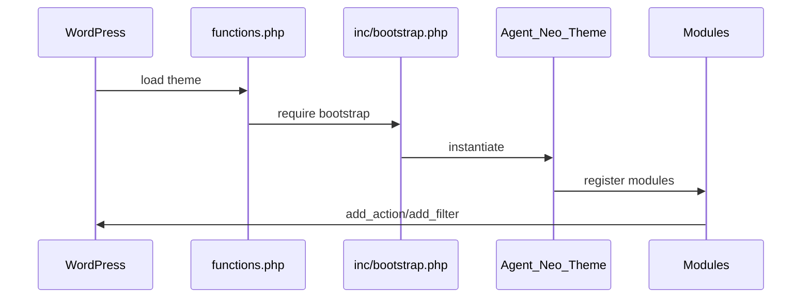
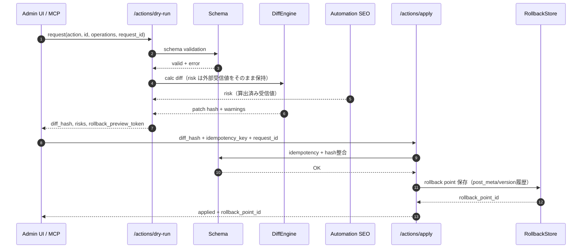
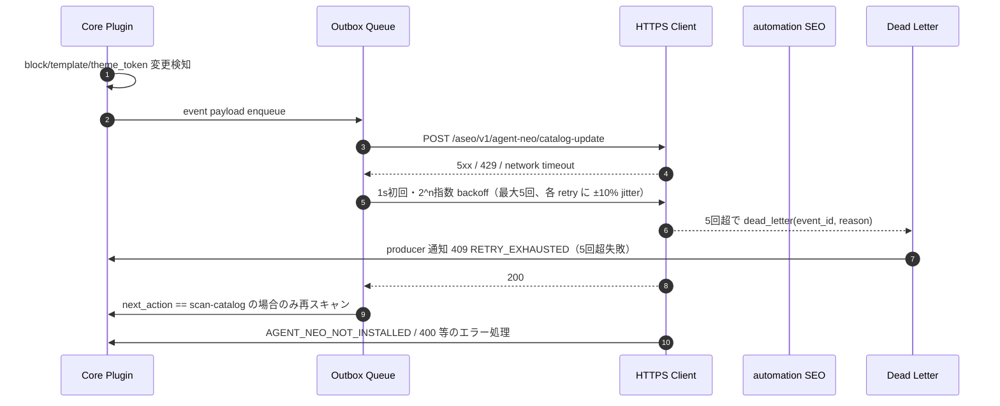
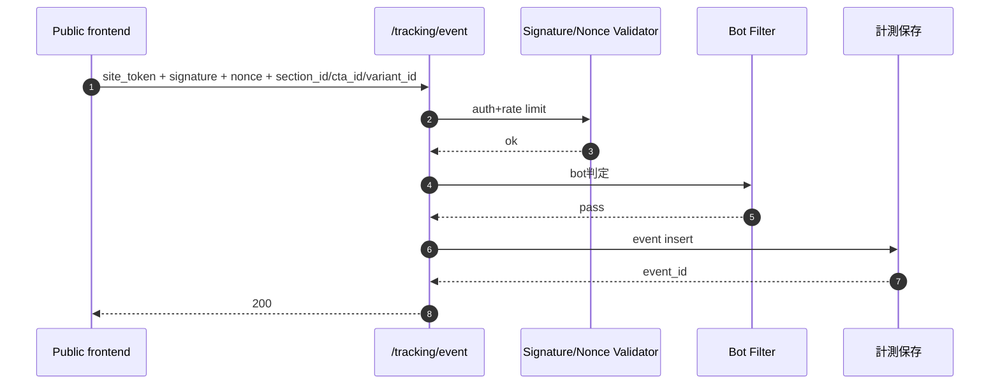
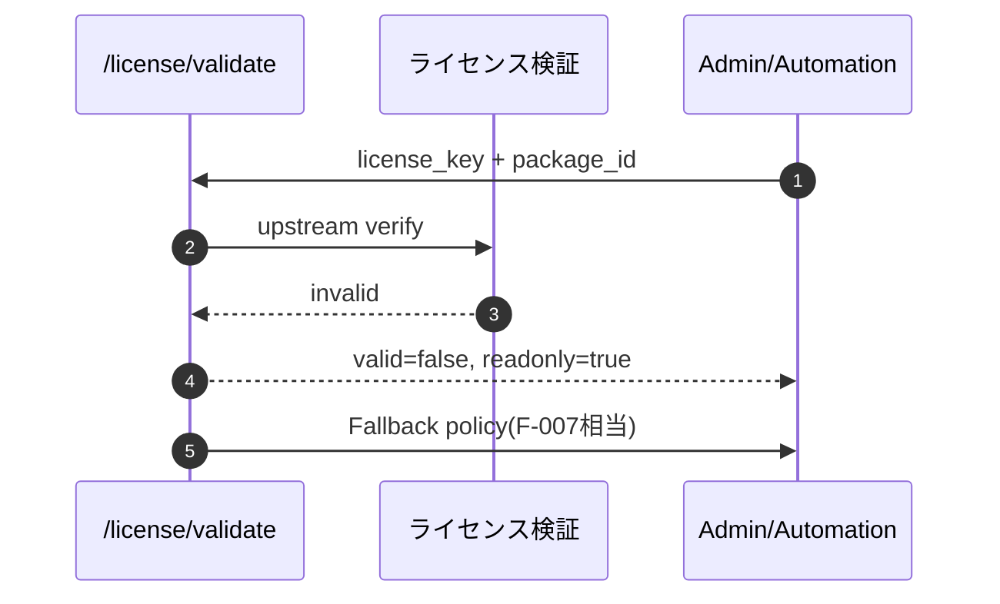

# AGENT NEO 詳細設計書

## 0. AGENT NEO Theme 詳細規約

### 0.1 Theme構成

| パス | 役割 | 所有 |
|---|---|---|
| `functions.php` | `ABSPATH`チェック、定数、`inc/bootstrap.php`読み込みのみ | Theme |
| `theme.json` | design tokens、spacing、typography、layout、settingsの正本 | Theme |
| `templates/` | FSE page template | Theme |
| `parts/` | header/footer/sidebar等のtemplate part | Theme |
| `patterns/` | LP/HP/affiliateの表示pattern | Theme |
| `inc/setup/` | theme support、i18n、menu、image size | Theme |
| `inc/assets/` | conditional asset、used block collector、critical CSS | Theme |
| `inc/blocks/` | visual-only block登録、render context | Theme |
| `inc/seo/` | head/schema render adapter。保存責務は持たない | Theme |
| `inc/security/` | sanitize/escape helper、allowlist | Theme |
| `config/` | `theme-manifest.json`、`asset-policy.json`、`section-registry.json` | Theme |

### 0.2 Coding Rules

| ID | ルール | 検証 |
|---|---|---|
| CR-001 | WordPress Coding Standards準拠 | PHPCS/WPCS |
| CR-002 | `functions.php`はbootstrapのみ | static grep |
| CR-003 | public hook/function/CSS/data属性は`agent_neo`/`an-` prefix | static grep |
| CR-004 | 入力はschema sanitize、出力はcontext escape | PHPCS + custom grep |
| CR-005 | blockは`block.json`を正本にする | block schema check |
| CR-006 | route/block/part別asset policyを持つ | asset policy test |
| CR-007 | jQueryは初期無効、必要時のみfeature flag | enqueue test |
| CR-008 | SEO/headは重複検出可能なadapter出力 | SEO coexistence test |
| CR-009 | 参照テーマのコード/CSS/画像/固有文言コピー禁止 | license review |
| CR-010 | theme無効化で消えると困るデータはthemeに保存しない | boundary review |

### 0.3 起動フロー

### 0.4 Theme/Core Plugin境界

| 機能 | Theme | Core Plugin |
|---|---|---|
| FSE templates/patterns/styles | owner | reference |
| visual-only block | owner | optional integration |
| section_id/cta_id属性 | owner | tracking/optimization |
| SEO head render | adapter | meta persistence/conflict detection |
| JSON操作API | manifest only | owner |
| CPT/A-B/tracking storage | no | owner |

**ADR-008 配布境界との整合確認済み（CARRY-G2-019）**: catalog-update の発火は Core Plugin の責務であり、テーマは表示責務のみを担う。テーマ側が catalog-update の送信・制御ロジックを持つことは ADR-008 配布境界違反となるため禁止。

## 1. API 詳細仕様（D-API）

**注記:** 正本は `api-catalog.md`（55 endpoint 一覧）を参照。ここでは Phase1 ローンチに直結する中核 endpoint のみ I/O を具体化する。  
**INT-006**: 本節の `A-001`〜`A-009` は L3 詳細化9 endpoint のローカル連番であり、`api-catalog.md` の `A-001(GET /status)` などとは別体系。対応は以下。

| L3-A-ID | 対応 endpoint |
|---|---|
| `A-001` | `POST /actions/dry-run` |
| `A-002` | `POST /actions/apply` |
| `A-003` | `PATCH /posts/{id}/blocks/{block_id}` |
| `A-004` | `POST /posts/{id}/sections/{section_id}/edit` |
| `A-005` | `POST /pages/{id}/apply` |
| `A-006` | `POST /pages/{id}/rollback` / `POST /rollback/{rollback_id}` |
| `A-007` | `POST /tracking/event` |
| `A-008` | `POST /license/validate` |
| `A-009` | `POST /aseo/v1/agent-neo/catalog-update` |

**A-008 二重定義注記**: L3 ローカル `A-008` = `POST /license/validate` であり、`api-catalog.md` の `A-008` = `POST /tracking/context` とは **別体系で矛盾ではない**。`api-catalog.md` における `POST /license/validate` は `A-011` に相当する。実装時は参照元（L3 本節 vs api-catalog）を必ず明示し、tracking-context と license/validate の ID を混同しないこと。

### A-001: `POST /actions/dry-run`

- **Method**: `POST`
- **Path**: `/actions/dry-run`
- **認証**: REST write 経路 `nonce + capability`（`edit_posts` 以上）
- **対応 REQ-F**: REQ-F-002, REQ-F-021, REQ-F-022, REQ-F-044
- **正本参照**: `api-catalog.md`（55 endpoint）。I/O とエラー定義のみ本節で展開。

#### Request

| フィールド | 型 | 必須 | 説明 | バリデーション |
|---|---|---|---|---|
| `action` | string | YES | `patch_post` / `patch_block` / `edit_section` / `apply_page` / `swap_section` | enum |
| `resource_id` | integer | YES | 対象の `post_id` または `page_id` | 数値正数 |
| `resource_sub_id` | string | 条件付き | `block_id` または `section_id`。`action` が section/block 系で必須 | UUID 形式 |
| `changes` | array<object> | YES | JSON Patch 形式または section edit 専用ペイロード | RFC 6902 互換 |
| `options` | object | NO | `strict`、`preview_only` | キーは定義済みのみ |
| `request_id` | string | YES | 冪等再利用時のトレースキー | UUIDv4 |

#### Response（200）

| フィールド | 型 | 説明 |
|---|---|---|
| `success` | boolean | dry-run 成功可否 |
| `request_id` | string | 受信トレースID |
| `diff_hash` | string | 応用時に `apply` で参照する RFC 6902 差分ハッシュ |
| `diff` | array<object> | 正規化済み差分（追加/更新/削除） |
| `risk` | object | `severity`/`items`（**入力=外部 AI 側判定結果のみを受信して保持**） |
| `validation` | object | schema エラー一覧 / Warnings |
| `dry_run_token` | string | 受信時短命トークン |
| `rollback_preview_token` | string | 直近保存時点の preview 用トークン |

#### Errors

| Status | Code | 条件 |
|---|---|---|
| 400 | VALIDATION_ERROR | 必須不足、JSON Patch 不正、`resource_id` 整合性違反 |
| 401 | UNAUTHORIZED | nonce/capability/認証欠落 |
| 403 | FORBIDDEN | API 権限不足（package / route 制限） |
| 409 | CONFLICT | section_id・block_id 解決不可（最新版不整合） |
| 400 | VALIDATION_ERROR | 許可外 patch 構文（実体に依存する更新） |

### A-002: `POST /actions/apply`

- **Method**: `POST`
- **Path**: `/actions/apply`
- **認証**: REST write `nonce + capability`
- **対応 REQ-F**: REQ-F-002, REQ-F-021, REQ-F-022
- **正本参照**: `api-catalog.md`（55 endpoint）。I/O とエラー定義のみ本節で展開。

#### Request

| フィールド | 型 | 必須 | 説明 | バリデーション |
|---|---|---|---|---|
| `action` | string | YES | `patch_post` / `patch_block` / `edit_section` / `apply_page` | dry-run で生成された値のみ許可 |
| `resource_id` | integer | YES | 対象記事/ページID | 正数 |
| `resource_sub_id` | string | 条件付き | `block_id` または `section_id` |
| `diff_hash` | string | YES | `dry-run` 由来の `diff_hash` |
| `idempotency_key` | string | YES | 再送安全キー |
| `request_id` | string | YES | 直近 dry-run と同一 `request_id` |
| `rollback_reason` | string | NO | 監査用メモ |
| `from_preview_token` | string | NO | preview 適用時のみ必須 |

#### Response（200）

| フィールド | 型 | 説明 |
|---|---|---|
| `success` | boolean | 適用可否 |
| `applied` | boolean | 実体反映したか |
| `diff_hash` | string | 実行した差分ハッシュ |
| `rollback_point_id` | string | rollback API の参照キー |
| `resource_version` | string | 変更後バージョン |
| `request_id` | string | 追跡キー |
| `audit_id` | string | AgentAction ログキー |
| `warnings` | array<object> | 後段検出警告（schema/SEO/a11y 等） |

#### Errors

| Status | Code | 条件 |
|---|---|---|
| 400 | VALIDATION_ERROR | `diff_hash` 無効、`from_preview_token` 欠落 |
| 401 | UNAUTHORIZED | 未認証 |
| 403 | FORBIDDEN | 編集権限なし |
| 409 | CONFLICT | idempotency 再送除外 / rollback_point 無効 |
| 412 | PRECONDITION_FAILED | dry-run 後の対象データ変更による不一致 |

### A-003: `PATCH /posts/{id}/blocks/{block_id}`

- **Method**: `PATCH`
- **Path**: `/posts/{id}/blocks/{block_id}`
- **認証**: REST write `nonce + capability`
- **対応 REQ-F**: REQ-F-021
- **正本参照**: `api-catalog.md`（55 endpoint）。I/O とエラー定義のみ本節で展開。

#### Request

| フィールド | 型 | 必須 | 説明 | バリデーション |
|---|---|---|---|---|
| `idempotency_key` | string | YES | ブロック更新の再送吸収キー（header または body） | UUIDv4 |
| `operations` | array<object> | YES | JSON Patch operations |
| `operation_context` | object | NO | 更新時刻・起点情報 |

#### Response（200）

| フィールド | 型 | 説明 |
|---|---|---|
| `success` | boolean | 更新可否 |
| `post_id` | integer | 対象投稿 |
| `block_id` | string | 対象ブロック |
| `diff_hash` | string | 適用差分ハッシュ |
| `resource_version` | integer | ブロック履歴バージョン |
| `rollback_point_id` | string | rollback 用 |
| `history` | array<object> | 直近 N 版のサマリ |

#### Errors

| Status | Code | 条件 |
|---|---|---|
| 400 | VALIDATION_ERROR | operations 不正 |
| 401 | UNAUTHORIZED | 認証不足 |
| 403 | FORBIDDEN | package 限定破棄 |
| 404 | NOT_FOUND | post/block 不存在 |
| 409 | CONFLICT | idempotency key 再送差分不一致 |

### A-004: `POST /posts/{id}/sections/{section_id}/edit`

- **Method**: `POST`
- **Path**: `/posts/{id}/sections/{section_id}/edit`
- **認証**: REST write `nonce + capability`
- **設計制約**: Section の受信・適用のみ。文章生成・方針選定は AGENT NEO 外部側（Automation SEO）に委任。
- **対応 REQ-F**: REQ-F-002, REQ-F-021, REQ-F-022
- **正本参照**: `api-catalog.md`（55 endpoint）。I/O とエラー定義のみ本節で展開。

#### Request

| フィールド | 型 | 必須 | 説明 | バリデーション |
|---|---|---|---|---|
| `section_id` | string | YES | 対象 section_id | `^[a-z0-9-]+$` 以外の表示slugを許容しない |
| `section_payload` | object | YES | `section_title` / `content` / `metadata` を含む |
| `changes` | array<object> | YES | JSON Patch または差分構造 |
| `idempotency_key` | string | YES | 再送制御 |
| `preview_only` | boolean | NO | false=即時適用、true=preview 差分のみ |

#### Response（200）

| フィールド | 型 | 説明 |
|---|---|---|
| `success` | boolean | 処理成功 |
| `post_id` | integer | 対象記事 |
| `section_id` | string | 対象 section_id |
| `diff_hash` | string | section diff hash |
| `applied` | boolean | 実適用可否 |
| `rollback_point_id` | string | rollback 用 |
| `risk` | object | 外部監査結果受信時のみ |

#### Errors

| Status | Code | 条件 |
|---|---|---|
| 400 | VALIDATION_ERROR | section_id 形式/payload 不整合 |
| 401 | UNAUTHORIZED | 認証不足 |
| 403 | FORBIDDEN | section write 権限なし |
| 404 | NOT_FOUND | section_id 不在 |
| 409 | CONFLICT | preview トークン不一致 |

### A-005: `POST /pages/{id}/apply`

- **Method**: `POST`
- **Path**: `/pages/{id}/apply`
- **認証**: REST write `nonce + capability` + package boundary
- **対応 REQ-F**: REQ-F-002, REQ-F-012, REQ-F-038
- **正本参照**: `api-catalog.md`（55 endpoint）。I/O とエラー定義のみ本節で展開。

#### Request

| フィールド | 型 | 必須 | 説明 | バリデーション |
|---|---|---|---|---|
| `from_preview_token` | string | NO | preview からの昇格時のみ必須 |
| `diff_hash` | string | YES | dry-run 由来 hash |
| `idempotency_key` | string | YES | 冪等キー |
| `template_id` | string | NO | LP/HP/template 適用時の参照ID |
| `rollback_note` | string | NO | rollback 一覧表示用 |

#### Response（200）

| フィールド | 型 | 説明 |
|---|---|---|
| `success` | boolean | apply 可否 |
| `page_id` | integer | 対象ページ |
| `rollback_point_id` | string | rollback API 参照キー |
| `diff_hash` | string | 適用 hash |
| `preview_state` | string | `consumed` / `ignored` |
| `request_id` | string | 追跡キー |
| `applied_blocks` | integer | 適用ブロック数 |

#### Errors

| Status | Code | 条件 |
|---|---|---|
| 400 | VALIDATION_ERROR | `idempotency_key` 欠落、diff 不一致 |
| 401 | UNAUTHORIZED | 認証不足 |
| 403 | FORBIDDEN | package 境界違反 |
| 404 | NOT_FOUND | page 不在 |
| 409 | CONFLICT | `diff_hash` 重複または不一致 |
| 400 | VALIDATION_ERROR | PATCH 版経路依存不正 |

### A-006: `POST /pages/{id}/rollback` / `POST /rollback/{rollback_id}`

- **Method**: `POST`
- **Path**:
  - `/pages/{id}/rollback`
  - `/rollback/{rollback_id}`
- **認証**: REST write `nonce + capability`
- **対応 REQ-F**: REQ-F-021, REQ-F-038
- **正本参照**: `api-catalog.md`（55 endpoint）。I/O とエラー定義のみ本節で展開。

#### Request（共通）

| フィールド | 型 | 必須 | 説明 | バリデーション |
|---|---|---|---|---|
| `rollback_point_id` | string | Path版のみ | `/pages/{id}/rollback` の場合は必須 |
| `reason` | string | NO | 運用監査理由 |
| `idempotency_key` | string | YES | rollback 再送防止 |
| `force` | boolean | NO | true=即時適用 |

#### Response（200）

| フィールド | 型 | 説明 |
|---|---|---|
| `success` | boolean | rollback 可否 |
| `restored_version` | string | 復元版識別子 |
| `page_id` | integer | 対象ページ |
| `rollback_point_id` | string | 使用したポイント |
| `request_id` | string | 追跡ID |
| `audit_id` | string | rollback監査ログ |

#### Errors

| Status | Code | 条件 |
|---|---|---|
| 400 | VALIDATION_ERROR | rollback 点不正 |
| 401 | UNAUTHORIZED | 未認証 |
| 403 | FORBIDDEN | 権限不足 |
| 404 | NOT_FOUND | rollback_point 不在 |
| 410 | GONE | 対象履歴が TTL 切れ |

### A-007: `POST /tracking/event`

- **Method**: `POST`
- **Path**: `/tracking/event`
- **認証**: 公開受付。`site_token`/`signature`/`nonce`/`rate_limit` を検証
- **対応 REQ-F**: REQ-F-006
- **正本参照**: `api-catalog.md`（55 endpoint）。I/O とエラー定義のみ本節で展開。

#### Request

| フィールド | 型 | 必須 | 説明 | バリデーション |
|---|---|---|---|---|
| `site_token` | string | YES | 公開時に配布されるトークン |
| `signature` | string | YES | HMAC 署名 |
| `nonce` | string | YES | 再送検知キー |
| `event_type` | string | YES | `impression` / `click` / `conversion` |
| `section_id` | string | YES | 計測対象 section |
| `cta_id` | string | YES | 計測対象 CTA |
| `variant_id` | string | YES | A/B variant |
| `article_id` | string | NO | 記事識別子（未指定時は URL 逆引き） |
| `metadata` | object | NO | カスタム属性（bot 判定除外キー等） |

#### Response（200）

| フィールド | 型 | 説明 |
|---|---|---|
| `success` | boolean | 受付可否 |
| `event_id` | string | 受理イベントキー |
| `replay` | boolean | 2重送信なら true |
| `queued` | boolean | 非同期保存受付 |
| `accepted_at` | string | 受理時刻 |

#### Errors

| Status | Code | 条件 |
|---|---|---|
| 400 | VALIDATION_ERROR | `section_id/cta_id/variant_id` 欠損 |
| 401 | SIGNATURE_INVALID | 署名/nonce 不正 |
| 403 | FORBIDDEN | bot policy / レート超過 |
| 429 | RATE_LIMITED | 利用上限 |

### A-008: `POST /license/validate`

- **Method**: `POST`
- **Path**: `/license/validate`
- **認証**: REST write `nonce + capability`
- **対応 REQ-F**: REQ-F-010, REQ-F-016
- **正本参照**: `api-catalog.md`（55 endpoint）。I/O とエラー定義のみ本節で展開。

#### Request

| フィールド | 型 | 必須 | 説明 | バリデーション |
|---|---|---|---|---|
| `license_key` | string | NO | 明示更新時のみ |
| `site_id` | string | YES | サイト識別 |
| `product_tier` | string | NO | `personal` / `corporate` / `addon` |
| `package_id` | string | YES | 利用想定パッケージ |
| `refresh` | boolean | NO | 強制再検証 |

#### Response（200）

| フィールド | 型 | 説明 |
|---|---|---|
| `valid` | boolean | 検証結果 |
| `package` | string | 有効化パッケージ |
| `readonly_mode` | boolean | 失敗時の縮退判定 |
| `reason` | string | 非 valid 時の理由 |
| `expires_at` | string | ISO8601 |
| `next_check_at` | string | 次回検証予定 |
| `license_state` | object | source/last_checked/error_code |

#### Errors

| Status | Code | 条件 |
|---|---|---|
| 400 | VALIDATION_ERROR | 必須項目欠落 |
| 401 | UNAUTHORIZED | 認証不足 |
| 403 | FORBIDDEN | 無効キー/制限違反 |
| 502 | LICENSE_GATEWAY_ERROR | 検証先障害 |

### A-009: `POST /aseo/v1/agent-neo/catalog-update`

- **Method**: `POST`
- **Path**: `/aseo/v1/agent-neo/catalog-update`
- **認証**: HMAC/nonce（Automation SEO canonical）。**旧鍵受付は catalog-update（F-01）のみ**。F-02 以降の operation では旧鍵を reject（権限逆流対策 / CARRY-G2-008）。
- **対応 REQ-F**: REQ-F-044, REQ-NF-025（契約分離）
- **正本**: `D-PLUGIN-CONTRACT §17`（再定義しない）
- **正本参照**: `api-catalog.md`（55 endpoint）。I/O とエラー定義のみ本節で展開。
- **補足**: Producer は Core Plugin。Theme/Plugin 受信側は `4` フィールド応答（`received/event_id/deduplicated/next_action`）と DLQ 作成を厳守。

- **CARRY-G2-001**: `catalog-update` 外部 push とその責務境界を明確化（ADR-012 優先）。

| 区分 | ADR-002 | ADR-012 |
|---|---|---|
| catalog-update 外部 push 契約所有 | 参照対象 | 所有 |
| 内部4操作面（dry-run / apply / rollback / preview） | 契約統一 | 参照 |
| AI 判定（risk/variant/CV/A-B） | `REQ-NF-025` で受信表示のみ | 非対象 |

- **REQ-NF-025 / CARRY-G2-013**: AI 判定（risk / variant / CV / A-B 連携）は AGENT NEO が算出しない。責務分割は「AI判断=Automation SEO 側」「公開 API 受付」「計測送信」として保持。

#### Request

| フィールド | 型 | 必須 | 説明 | バリデーション |
|---|---|---|---|---|
| `site_hash` | string | YES | サイト識別子 |
| `agent_neo_version` | string | YES | テーマ版 |
| `event_kind` | string | YES | `block_registered` / `block_unregistered` / `template_updated` / `theme_token_updated` |
| `event_id` | string | YES | 冪等キー（UUIDv4 / 24h TTL、Redis） |
| `occurred_at` | string | YES | ISO8601 |
| `payload` | object | YES | `block_name` / `template_part_slug` / `diff` |

#### Response（200）

| フィールド | 型 | 説明 |
|---|---|---|
| `received` | boolean | 受信結果 |
| `event_id` | string | 受信イベントキー（echo） |
| `deduplicated` | boolean | 再送時 true |
| `next_action` | string | `scan-catalog` / `none` |

#### Errors

| Status | Code | 条件 |
|---|---|---|
| 400 | VALIDATION_ERROR | `event_kind` 欠落含むバリデーション不正 |
| 401 | PLUGIN_AUTH_FAILED | 署名/認証不備 |
| 409 | AGENT_NEO_NOT_INSTALLED | `metadata_json.theme_slug != 'agent-neo'` |
| 429 | RATE_LIMITED | 接続過多 |
| 5xx | INTERNAL_ERROR | 再試行対象 |

#### 補足

- `next_action` は deduplicated 含め全応答必須。4 フィールドは初回/再送同一（`received/event_id/deduplicated/next_action`）。
- `event_id` は UUIDv4 / 24h TTL（Redis）で冪等キーを運用し、重複時は deduplicated 応答。
- `AGENT-NEO` は §17.11 準拠で retry 対象を `5xx` / `429` / `network timeout` に限定。`4xx（429 を除く）` と `event_id` 重複は再試行しない。
- `5 回失敗` 時は `dead_letter(event_id, reason)` を DLQ へ発行し、Producer へ `409 RETRY_EXHAUSTED` を通知する。

## 2. ストレージ詳細（D-STORAGE）

### 2.1 前提

本製品は WP 既存ストレージを中核とし、`WP options / post_meta / transients / CPT` を組み合わせる。
`relations DB` の独自新規テーブル増設は原則禁止。必要最小のカスタムテーブルは既存 Core Plugin 側実装計画のみで、詳細は別契約で追加する。

### 2.2 `wp_postmeta`（Core Plugin 所有）

#### `_agent_neo_*` キー一覧

| Key | 所有 | 役割 | 値の例 |
|---|---|---|---|
| `_agent_neo_sections` | Core Plugin | section_id 一覧（`section_id`/`display_section_slug`/h2 range） | JSON 配列 |
| `_agent_neo_cta_index` | Core Plugin | cta_id 目録と表示文言 | JSON |
| `_agent_neo_variant_index` | Core Plugin | variant_id と A/B 状態 | JSON |
| `_agent_neo_article_id` | Core Plugin | 記事の安定 ID（UUID） | UUIDv4 |
| `_agent_neo_cms_post_id` | Core Plugin | v2 同期キー | UUIDv4 |
| `_agent_neo_preview_content` | Core Plugin | Tier1 サンドボックス本文 |
| `_agent_neo_preview_token` | Core Plugin | apply 参照トークン |
| `_agent_neo_version_history` | Core Plugin | section/block の差分履歴参照 |
| `_agent_neo_blueprint_id` | Core Plugin | LP/HP blueprint 現在値 |
| `_agent_neo_block_catalog_version` | Core Plugin | block catalog hash |
| `_agent_neo_block_registry` | Core Plugin | section / CTA / offer 対応表 |
| `_agent_neo_rollback_points` | Core Plugin | rollback_point_id と対象リソース対応 |
| `_agent_neo_offer_index` | Core Plugin | 法人用 offer_id 紐付け |

注記: これらのキーは Theme 変更・無効化では削除せず、Core Plugin / uninstall 時のみ定義した手順で消す。

### 2.3 options / transients

| 項目 | 所有 | 用途 |
|---|---|---|
| `agent_neo_feature_flags` | Core Plugin | 機能オンオフ（JSON） |
| `agent_neo_license_state` | Core Plugin | package/validity/read-only 状態 |
| `agent_neo_catalog_cache` | Core Plugin | catalog-update payload キャッシュ（TTL） |
| `agent_neo_tracking_signature_cache` | Core Plugin | 受信署名の重複検知 |
| `agent_neo_once_tokens` | Core Plugin | 再送防止 once-token 永続化 |
| `agent_neo_replay_tokens` | Core Plugin | DB フォールバック replay 管理（`UNIQUE event_signature`） |

`transients`:
- `agent_neo_tmp_rollback:{rollback_id}`（ロールバック参照）
- `agent_neo_catalog_dlq:{tenant}:{event_id}`（DLQ 一時保持）
- `agent_neo_rate_block:{ip}`（tracking レート制御）

### 2.4 CPT（Core Plugin 所有）

| CPT | 用途 | 取得/保持項目 |
|---|---|---|
| `agent_action` | 操作ログ（dry-run/apply/rollback） | action_type/request_id/diff_hash/idempotency_key/audit |
| `agent_section_registry` | section_id・cta_id・variant_id の組み合わせ検証 | post_id、section_id、cta_id、variant_id |
| `agent_agent_license` | ライセンス検証結果履歴 | package/check_time/ttl/readonly_mode |

### 2.5 JSON Schema 契約一覧（L2 §8.x）と所有

| 契約ファイル | 役割 | 所有層 |
|---|---|---|
| `agent-actions.schema.json` | AgentAction の JSON I/O 形式を検証 | Core Plugin |
| `job-contract.schema.json` | ジョブ起動・完了イベントを整形 | Core Plugin |
| `event-contract.schema.json` | 受信イベント（tracking/event 等）のスキーマ検証 | Core Plugin |
| `webhook-contract.schema.json` | 外部連携受け口のペイロード検証 | Core Plugin |
| `error-catalog.json` | 仕様エラーを共通化 | Core Plugin |
| `mcp-tools.schema.json` | MCP 連携 I/O と許可操作を定義 | Core Plugin |
| `wp-cli-contract.json` | CLI 運用コマンド入力検証 | Core Plugin |
| `automation-schedule.schema.json` | 時間系ジョブ定義の契約 | Core Plugin |
| `catalog-update.schema.json` | catalog-update 要求の検証。**ADR-018 準拠（再定義しない互換ミラー）**。AGENT-NEO 側は本スキーマを参照コピーとして保持し自律変更禁止。automation SEO 側 `D-PLUGIN-CONTRACT §17` を正本とし、CI 差分ゼロ検証で一致を担保する。payload は §17.2 の送信保証を採用。※CARRY-G2-002 解決済 |
| `agent-operability.schema.json` | 運用監査データの検証 | Core Plugin |
| `dom-anchor.schema.json` | DOM anchor と section anchor の検証 | Core Plugin |
| `content-snapshot.schema.json` | スナップショット保存内容の契約 | Core Plugin |
| `tracking-context-v2.schema.json` | 計測文脈と署名検証の前提契約。`selector_contract`（block anchor / heading hash / selector）を明記し、取得元解釈責務を分離（CARRY-G2-024）およびスキーマフィールド統一（CARRY-G2-027）の両 carry を本スキーマで閉じる。※CARRY-G2-024 / CARRY-G2-027 |
| `crawler-access-matrix` | `search` / `ai-input` / `ai-train` / `snippet` / `WAF` 判定キーを `ADR-013` で一元管理。`ai-visibility-policy` と重複しない。※CARRY-G2-020 |
| `ai-crawler-policy` | ADR-013 の機械契約に基づく公開判定・可視化ルールの定義。`crawler-access-matrix` の対で運用。※CARRY-G2-020 |
| `theme-capability.schema.json` | Theme/Plugin 能力宣言の検証 | Core Plugin |
| `cta-offer-mapper.schema.json` | CTA と offer の対応性検証 | Core Plugin |
| `quality-gate-result.schema.json` | 品質ゲート判定値フォーマット | Core Plugin |
| `release-policy.schema.json` | リリース条件と検収条件の契約 | Core Plugin |
| `risk-ledger.schema.json` | リスク履歴と監査追跡の契約 | Core Plugin |
| `seo-risk.schema.json` | SEO 競合リスクのデータ契約 | Core Plugin |
| `claim-risk.schema.json` | automation SEO 算出の claim-risk 評価を受信して表示するための受信ペイロード。AGENT-NEO 側で算出しない（REQ-NF-025）。※CARRY-G2-018 |
| `asset-policy.schema.json` | 使用メディア制約と安全基準を定義 | Theme/Core 連携 |
| `media-policy.schema.json` | 画像・動画の制約条件を定義 | Theme/Core 連携 |
| `performance-profile.json` | パフォーマンス予算プロファイル | Theme/Core 連携 |
| `web-vitals-budget.json` | LCP/INP/CLS 許容閾値 | Theme/Core 連携 |

### 2.6 ADR-013 クローラー契約 責務境界（CARRY-G2-020）

ADR-013 が規定するクローラー制御 3 アーティファクトの責務と評価順序を以下に定める。

| アーティファクト | 粒度 | 責務 | 備考 |
|---|---|---|---|
| `crawler-access-matrix.json` | bot/crawler 種別（Googlebot / GPTBot / ClaudeBot 等） | 許可マトリクスの source of truth。`robots.txt` 生成の起点 | ai-visibility-policy と重複しない |
| `ai-visibility-policy.json` | ページ粒度 | crawler-access-matrix に対するページ単位の override | 基底マトリクスを上書きする補正レイヤー |
| `ai-crawler-policy` | bot 別公開判定 | crawler-access-matrix の導出先。機械契約ベースの可視化ルール定義 | crawler-access-matrix と対で運用 |

**評価順序**: `crawler-access-matrix`（基底）→ `ai-visibility-policy`（ページ override）。conflict 時はより制限的な方を採用する。L2 §8.8 / §8.10 と同方針。

### 2.7 ID 体系（data-model-ids）運用

- 内部 slug（保存・ルーティング）: `^[a-z0-9-]+$`。
- 表示用 slug: 別途 `sanitize_title` で別管理。
- 一致要件: `section_id` など既存 ID の ASCII 主幹は不変、表示 slug は更新時のみ再生成。

### 2.7 アンインストール

`uninstall-cleanup-policy.json` 相当運用手順（未実装は要件に従って追加）:

- plugin 無効化/削除時に以下を削除
  - CPT: `agent_action`, `agent_section_registry`, `agent_agent_license`
  - post_meta: `_agent_neo_*`（上記テーブルの全キー）
  - options/transients: `agent_neo_*`
  - 外部連携キュー（catalog DLQ、再送予約）
  - ロールバック履歴・tracking 原本
- `post_id` 単位で残骸がある場合はバッチ削除キューを実行

## 3. 画面仕様（D-UI）

### 3.1 中核画面一覧

対象: L2 §6 の S-001〜S-015 からローンチ中核 6 画面を採用。

#### S-001 Dashboard
- **目的**: Core 健全性（license, apply 成功率, tracking 欠損率）を一目で把握
- **主なコンポーネント**: Health サマリカード、最新操作ログ、品質ゲートステータス、配信トラフィック
- **状態**: 読み取り時はローディング/エラー/部分更新
- **データソース**: `GET /agent-actions`、内部運用 API（`agent_action` ログ）

#### S-002 Agent Actions
- **目的**: dry-run/apply/rollback の操作を UI から実行し監査化
- **主なコンポーネント**: DryRun Form、差分プレビュー、apply ボタン、rollback ダイアログ
- **状態**: `dry-run pending` / `applied` / `rollback available` / `error`
- **データソース**: `/actions/dry-run`, `/actions/apply`, `agent_action` CPT

#### S-007 License / Package
- **目的**: パッケージ種別（個人/法人/アドオン）と read-only fallback を管理
- **主なコンポーネント**: パッケージ選択、検証トリガ、期限表示、fail-open ではない縮退表示
- **状態**: `valid` / `expired` / `readonly_mode` / `pending`
- **データソース**: `POST /license/validate`, options: `agent_neo_license_state`
- **2モード縮退（CARRY-G2-014 / L2 §8.6 / TB-18a / T-013 準拠）**: ライセンス障害の種別に応じて挙動を分離する。fail-open は両モード共通で絶対禁止。
  - **invalid / 失効（確定的に無効）**: ライセンス自体が invalid・失効・明確に未ライセンスとしてサーバが応答した場合。**即時 deny**（grace なし）→ 法人機能を無効化 → 個人版スコープ（記事 CRUD のみ）へ縮退。HTTP レスポンス: `403 FEATURE_DISABLED`。TB-18a「必ず deny」はこのモードを対象とする。
  - **transient（サーバ到達不能 / 502 / 3回連続失敗）**: ライセンスサーバへの一時的な到達不能の場合。**grace period 48h を適用**。grace 期間中は現スコープを **readonly 縮退**（計測・公開・閲覧は維持、write 系操作はブロック）で継続し、write 系リクエストには `503 LICENSE_GRACE_PERIOD` を返す。grace 満了後に個人版スコープ（記事 CRUD のみ）へ自動降格（`403 FEATURE_DISABLED`）。grace period の具体値（48h）は package-matrix `PF-002` / `PF-010` を SSOT とする。

#### S-008 SEO Core
- **目的**: meta/OGP/canonical/robots の保存と重複検知表示を運用
- **主なコンポーネント**: メタ編集フォーム、重複検知バナー、JSON-LDプレビュー
- **状態**: valid/duplicate/error/pending
- **データソース**: SEO APIs、`seo-risk.schema` 判定結果

#### S-010 AI Operability
- **目的**: 触れる対象要件（`data-agent-section-id`, `data-cta-id`）と snapshot を監視
- **主なコンポーネント**: snapshot表示、anchor検査、crawler ポリシー切替、AI crawler log 一覧
- **状態**: public/private/audit mode、警告レベル別
- **データソース**: `GET /public/pages/{id}/snapshot`, `GET /public/crawl-map`, `GET /tracking/context`

#### S-011 Quality Governance
- **目的**: Theme Review と品質門（a11y/RTL/i18n/performance）を集約
- **主なコンポーネント**: gate 一覧、失敗要因、再実行ボタン
- **状態**: `pass/fail/warn/not-run`
- **データソース**: `quality-gate-result.schema.json` 相当API、`/public/llmo/answers` ではなく内部監査ストア
- **1:1 対応（CARRY-G2-010）**: Theme Review / Accessibility / i18n-RTL / Release-SBOM / Hosting / Privacy / SEO Indexing / Documentation
  - 主要 fail 条件: Theme Review(致命的指摘)、Accessibility(axe core 重大違反)、i18n-RTL(RTL 表示崩れ)、Release-SBOM(SBOM 不整合)、Hosting(ホスティング規約違反)、Privacy(cookie 同意不足)、SEO Indexing(noindex/robots 破損)、Documentation(ADR/API 参照漏れ)

### 3.2 実装対象外（L5 で詳細化）

S-003, S-004, S-006, S-009, S-012〜S-015 は L5 での Visual Refinement/UX 仕様として分離。

## 4. 処理フロー

### 4.1 JSON apply（dry-run → apply → rollback）

### 4.2 catalog-update outbox（Theme 変更 → push）

- **CARRY-G2-003**: 本 outbox は §8.7 汎用ジョブ状態遷移と独立して実装し、ジョブ CPT へ状態保存しない。outbox は独自の再試行カウンタ（最大5回）を保持する。
- **DC-F-002 / F-001**: 再試行対象は `5xx`・`429`・`network timeout`、`4xx（429を除く）` と `event_id` 重複は再試行除外。

### 4.3 tracking event

### 4.4 license validate fallback

## 5. テスト設計

本節は単独正本 `docs/test-plan/L3-test-plan.md` に移管済み。  
要約: API/契約/UIの各階層で P0/P1 を分離したテストピラミッドを採用し、Contract・a11y・i18n/RTL・Performance・Security を CI ゲート化する。  
正本: `docs/test-plan/L3-test-plan.md`

### 5.1 テスト戦略（要約）

| レベル | 方針 |
|---|---|
| Contract | `CAT-001` 〜 `CAT-008` を中心に、catalog-update 契約を軸に検証 |
| API | dry-run/apply/rollback の状態遷移（正常・異常・冪等）を確実化 |
| Quality | a11y / i18n-RTL / performance / security を LCP/INP/CLS とともに門番化 |

## 6. 工程表（WBS）

本節は単独正本 `docs/design/L3-WBS.md` に移管済み。  
要約: F-001、F-002、F-044、F-011、F-006/F-007/F-026/F-027（連携群）を軸に 26 タスクを管理し、`.1a〜.5` sprint で実装分割。  
クリティカルパスは `T-001 → T-004 → T-006 → T-007 → T-010 → T-011 → T-014 → T-015 → T-024`（T-018 は並走・本線外）。  
正本: `docs/design/L3-WBS.md`
