# HELIX Neo パーツ図鑑（テンプレート / パーツ / パターン カタログ）

撮影: 使い捨て PoC 検証台（WP 7.1、AGENT NEO 0.1.0 + HELIX Neo 子テーマ）、2026-08-27、Playwright desktop 1366 / mobile 390。
画像は `img/` に格納（pattern・part は要素単位、template は全画面）。
配色はテーマ既定（オレンジ系）ではなく、PoC で HELIX Design Bridge が投影したトークン（ティール系、source: helix_poc_test）で写っている。

## ページ（templates 10）

| template | title | parts | patterns | 役割 |
|---|---|---|---|---|
| 404 | - | header + footer | 0 | 404。検索フォーム＋ホーム CTA＋最新記事。 |
| archive | - | header + footer | 0 | カテゴリ／タグ／著者／日付。見出し＋カードグリッド。 |
| blank | Blank | - | 0 | 白紙。header/footer なし。埋め込み・LP 実験用。 |
| front-page | - | header + footer | 7 | トップ。7 つの home-* パターンを直列。 |
| index | - | header + footer | 0 | 投稿一覧のフォールバック。 |
| no-header | No Header | footer | 0 | header なし・footer あり。 |
| page-lp-sample | LP サンプル（5セクション） | header + footer | 12 | LP。header/footer 付きで lp-* 12 セクションを直列（lp-benefit は未使用）。 |
| page | - | header + footer | 0 | 固定ページ既定。パンくず＋本文。 |
| search | - | header + footer | 0 | 検索結果。検索フォーム＋カード。 |
| single | - | header + post-header + post-footer + footer | 0 | 投稿。post-header（パンくず・メタ）＋本文＋post-footer（シェア・CTA・著者）＋関連・前後ナビ・コメント。 |

## パーツ（template parts 4）

| part | area | patterns | 内容 |
|---|---|---|---|
| header | header | - | サイト名・グローバルナビ・ヘッダー CTA |
| footer | footer | footer-credit | 3 カラム + footer-credit |
| post-header | uncategorized | - | パンくず・タイトル・投稿メタ・アイキャッチ |
| post-footer | uncategorized | share-buttons, article-cta, author-profile | タグ・シェア・記事末 CTA・著者 |

## パターン（24）

### ホーム構成（front-page の 7 セクション）

| # | slug | title | block types | post types | 使用箇所 | 説明 |
|---|---|---|---|---|---|---|
| 1 | agent-neo/home-hero | ホーム ① Brand Hero | core/group | wp_template, page | front-page | home-blueprint 第1セクション。ブランドの第一印象を作るメインビジュアル。 |
| 2 | agent-neo/home-gateway | ホーム ② Gateway Grid | core/group | wp_template, page | front-page | home-blueprint 第2セクション。目的別導線カード3列（DP-003 Gateway）。 |
| 3 | agent-neo/home-overview | ホーム ③ Product Overview | core/group | wp_template, page | front-page | home-blueprint 第3セクション。AGENT NEO の主要機能を3列で紹介。 |
| 4 | agent-neo/home-cases | ホーム ④ Case Studies | core/group | wp_template, page | front-page | home-blueprint 第4セクション。導入事例（サンプル数値）を3列で表示。 |
| 5 | agent-neo/home-resources | ホーム ⑤ Resources | core/group, core/query | wp_template, page | front-page | home-blueprint 第5セクション。最新記事・ガイドを3件グリッド表示。 |
| 6 | agent-neo/home-trust | ホーム ⑥ Trust | core/group | wp_template, page | front-page | home-blueprint 第6セクション。AGENT NEO が選ばれる理由を数値4列で表示。 |
| 7 | agent-neo/home-final-cta | ホーム ⑦ Final CTA | core/group | wp_template, page | front-page | home-blueprint 第7セクション。ページ末尾の導入促進 CTA。accent-aa 背景に白文字。 |

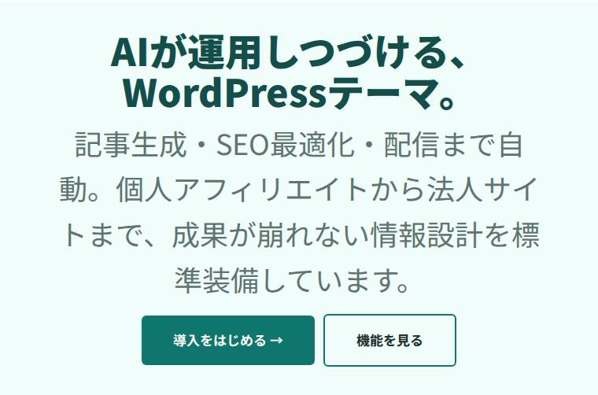
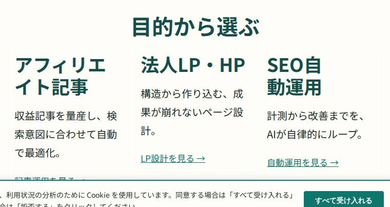
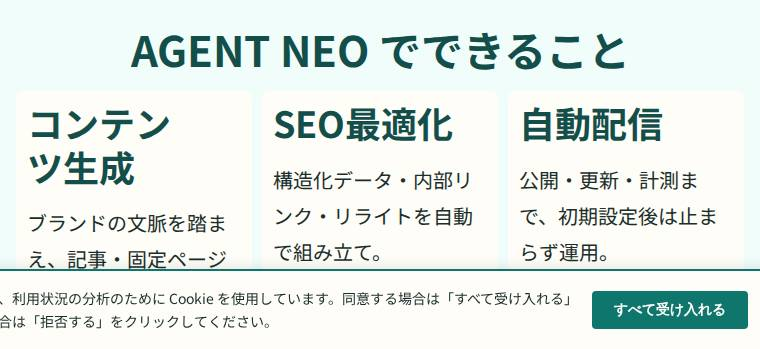
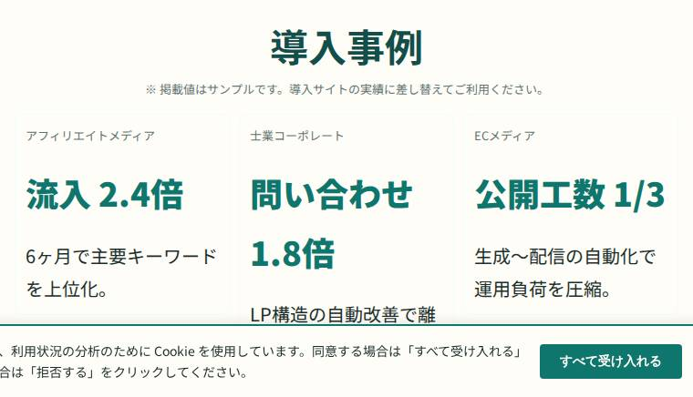
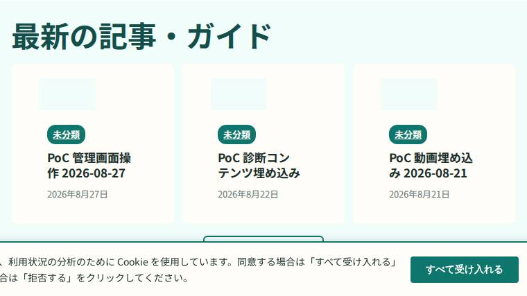
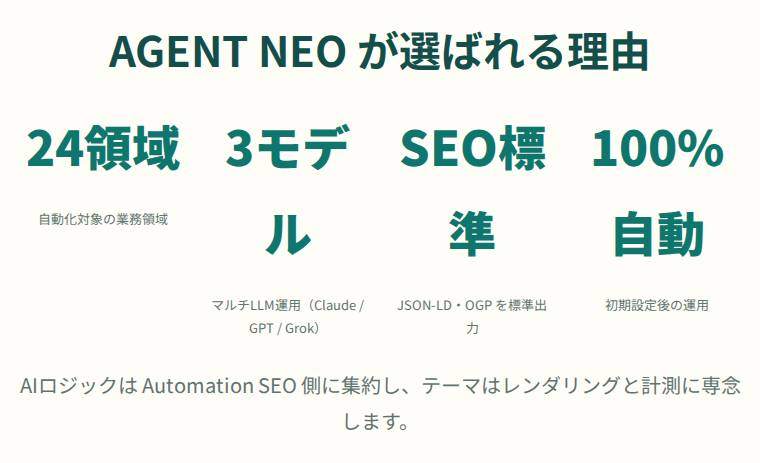
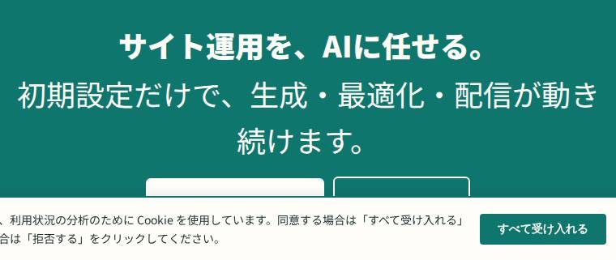

### LP 構成（page-lp-sample の 13 セクション）

| # | slug | title | block types | post types | 使用箇所 | 説明 |
|---|---|---|---|---|---|---|
| 1 | agent-neo/lp-hero | LP ヒーロー（ファーストビュー） | core/group | page, wp_template | page-lp-sample | LP ファーストビュー。大見出し・リード文・オレンジ CTA ボタン。secondary 背景帯。 |
| 2 | agent-neo/lp-problem | LP 課題提起（こんなお悩みありませんか） | core/group | page, wp_template | page-lp-sample | LP 課題提起セクション。3カラムの悩み一覧。白背景帯。 |
| 3 | agent-neo/lp-agitation | LP 課題増幅（このままだと…） | core/group | page, wp_template | page-lp-sample | LP 課題増幅セクション。放置コスト・危機感をオレンジ強調の警告調で訴求。secondary 背景帯。 |
| 4 | agent-neo/lp-solution | LP 解決提示（AGENT NEO ができること） | core/group | page, wp_template | page-lp-sample | LP 解決提示セクション。テキスト + 図版プレースホルダの 2カラム。secondary 背景帯。 |
| 5 | agent-neo/lp-feature | LP 機能一覧（主要機能） | core/group | page, wp_template | page-lp-sample | LP 機能セクション。4カラム・オレンジアイコン番号＋見出し＋説明テキスト。白背景帯。 |
| 6 | agent-neo/lp-benefit | LP 提供価値（選ばれる理由） | core/group | page, wp_template | page-lp-sample | LP 価値・特徴セクション。4カラム・オレンジ見出し＋説明テキスト。白背景帯。 |
| 7 | agent-neo/lp-use-case | LP 活用シーン（業種・用途別ユースケース） | core/group | page, wp_template | page-lp-sample | LP 活用シーンセクション。業種・用途カード3例・Before→After 形式。secondary 背景帯。 |
| 8 | agent-neo/lp-proof | LP 実績・エビデンス（数値で示す） | core/group | page, wp_template | page-lp-sample | LP 実績セクション。大きな数値+ラベルの 4カラム。白背景帯。 |
| 9 | agent-neo/lp-comparison | LP 比較（従来 vs AGENT NEO） | core/group | page, wp_template | page-lp-sample | LP 比較セクション。従来の手法と AGENT NEO の 2カラム対比。AGENT NEO 側をオレンジ強調。白背景帯。 |
| 10 | agent-neo/lp-pricing | LP 料金プラン | core/group | page, wp_template | page-lp-sample | LP 料金プランセクション。3プランカード（推奨プランをオレンジ枠強調・価格大きく・特徴リスト・CTAボタン）。白背景帯。 |
| 11 | agent-neo/lp-faq | LP よくある質問（FAQ） | core/group | page, wp_template | page-lp-sample | LP FAQ セクション。Q をオレンジ太字、A を通常テキストで5問構成。secondary 背景帯。 |
| 12 | agent-neo/lp-final-cta | LP 最終 CTA（締め） | core/group | page, wp_template | page-lp-sample | LP 最終 CTA セクション。濃インク帯・白見出し・オレンジ CTA ボタン（大）。コントラスト強め。 |

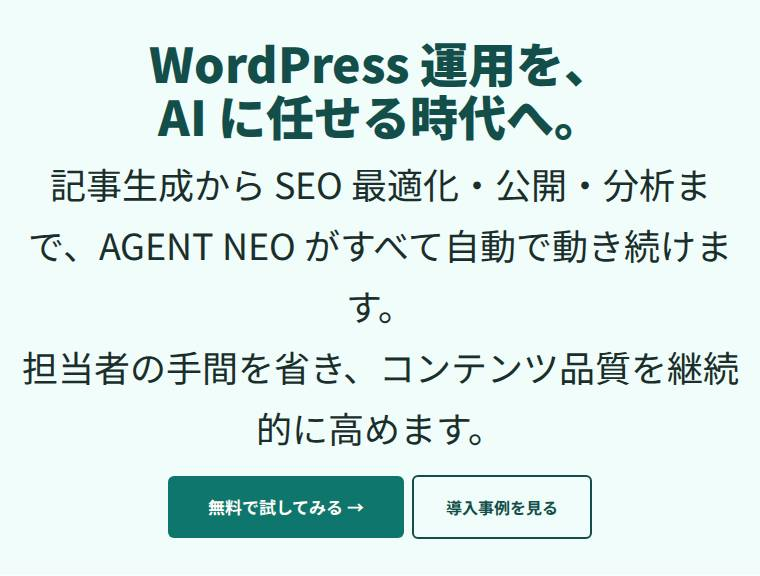
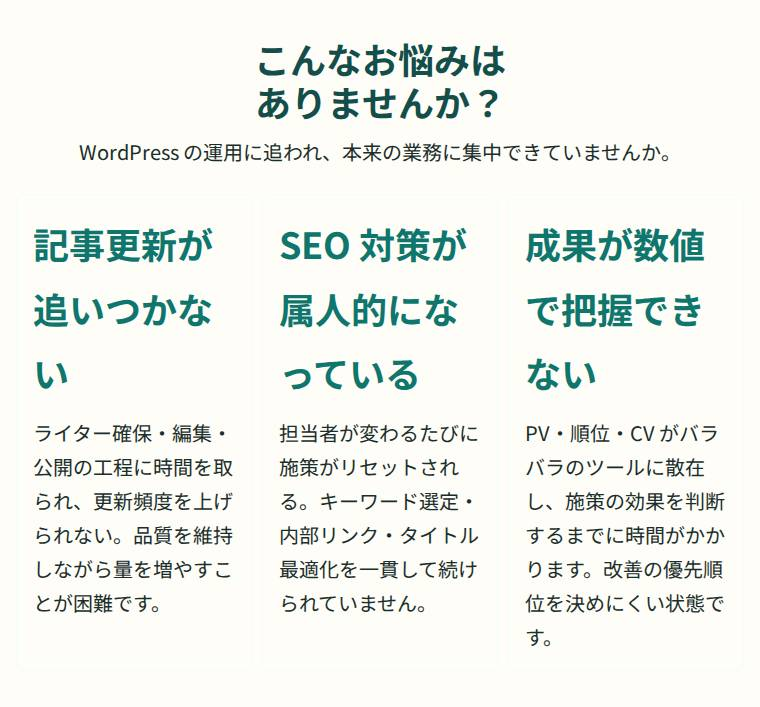
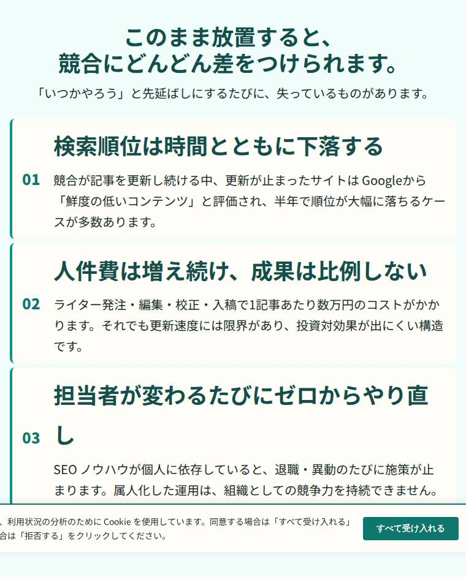
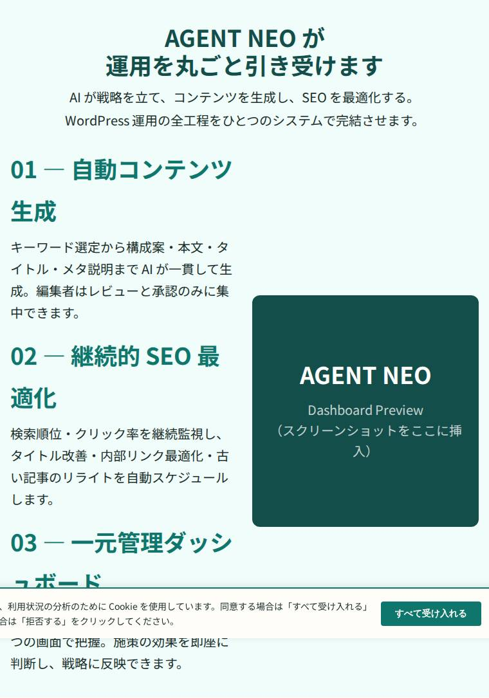
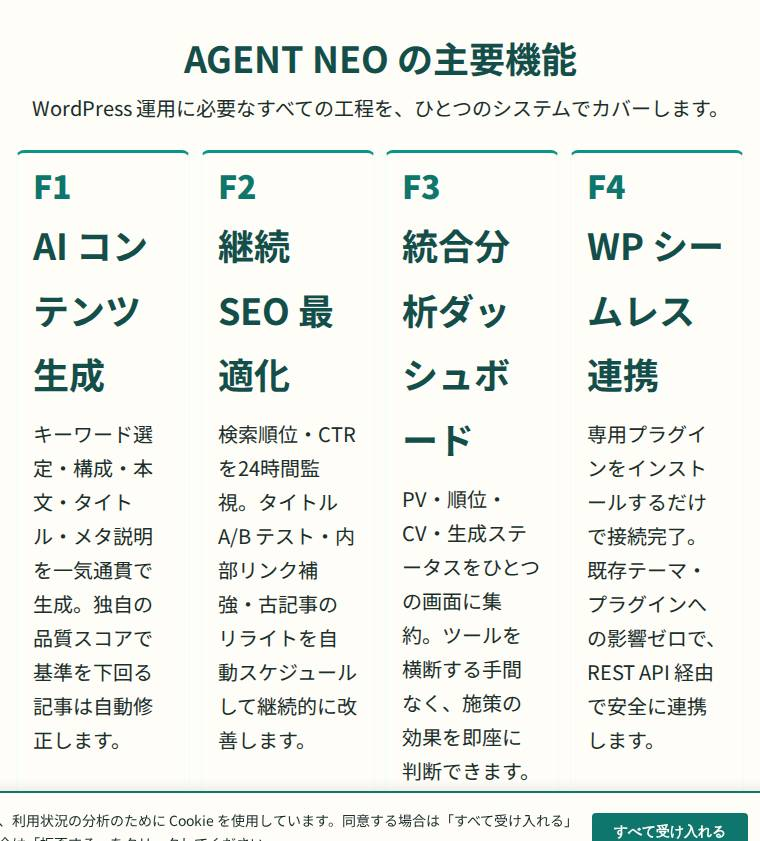
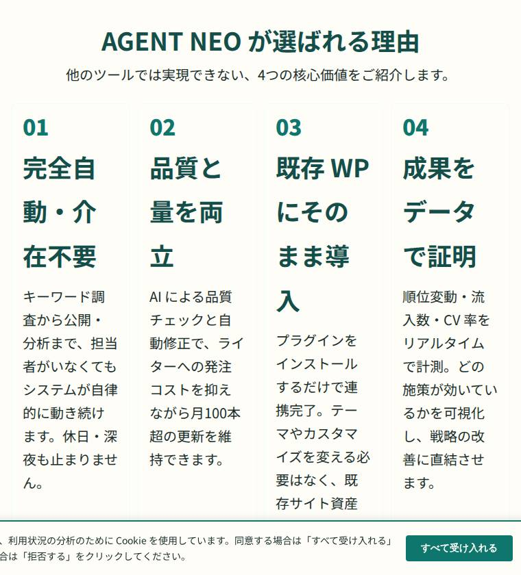
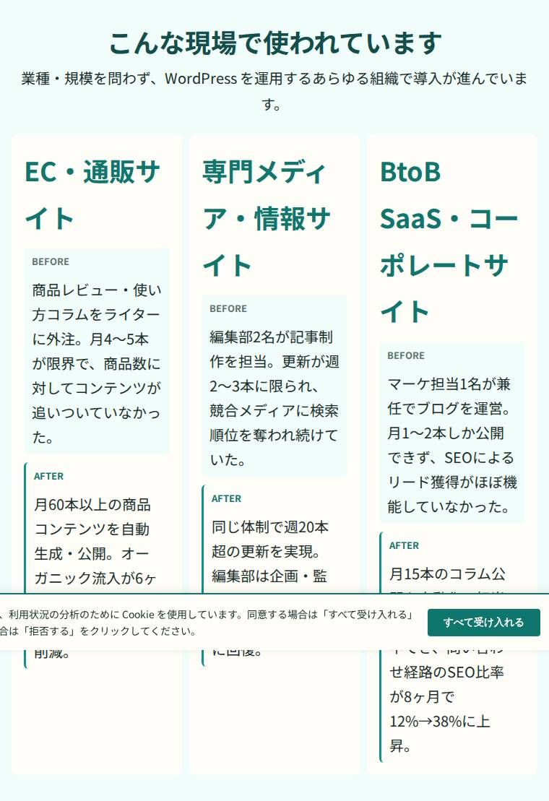
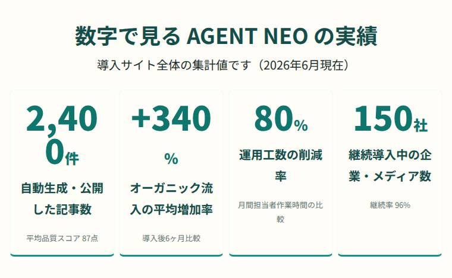
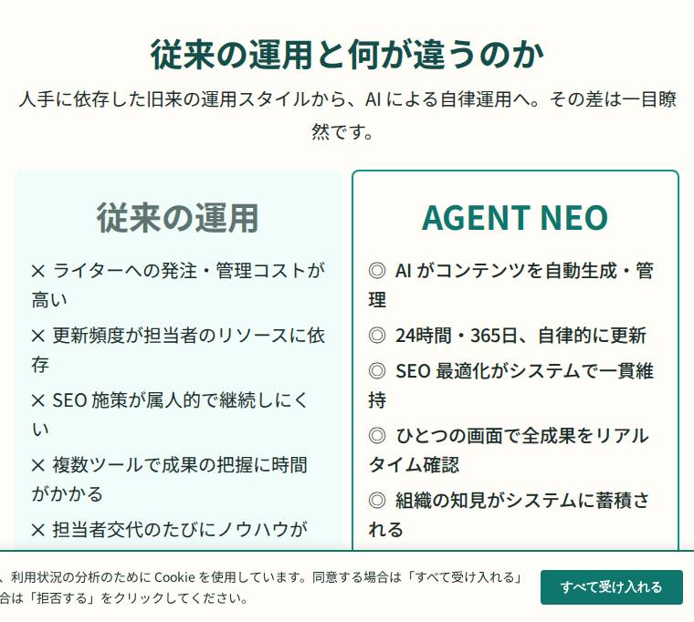
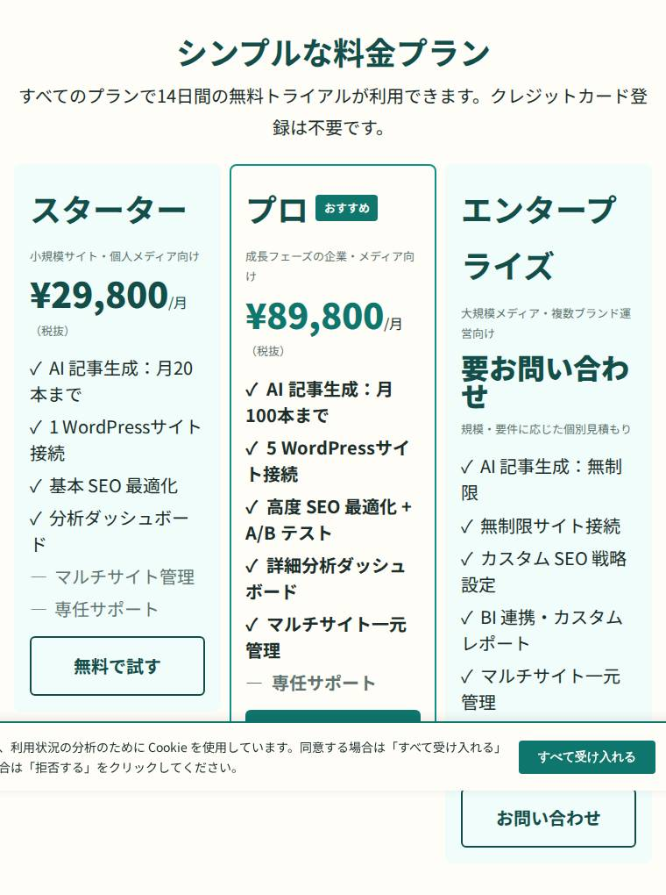
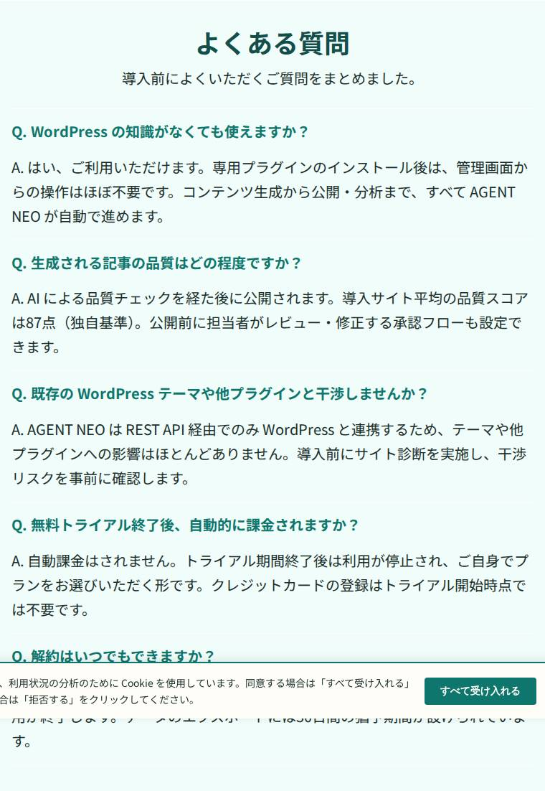
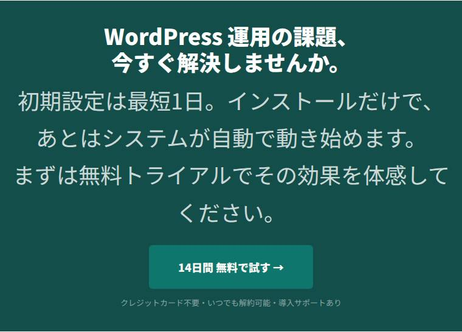

### 記事末パーツ（post-footer）

| # | slug | title | block types | post types | 使用箇所 | 説明 |
|---|---|---|---|---|---|---|
| - | agent-neo/article-cta | 記事末 CTA | core/group | wp_template, post | part:post-footer | 記事ページ末尾に表示する AGENT NEO 導入 CTA バナー。 |
| - | agent-neo/author-profile | 著者プロフィール | core/group | wp_template, post | part:post-footer | 記事末尾に表示する著者プロフィールボックス（アバター・表示名・自己紹介・アーカイブリンク）。 |
| - | agent-neo/share-buttons | シェアボタン | core/group | wp_template, post | part:post-footer | 記事末尾に表示するSNSシェアボタン（X / Facebook / LINE / はてブ）。 |

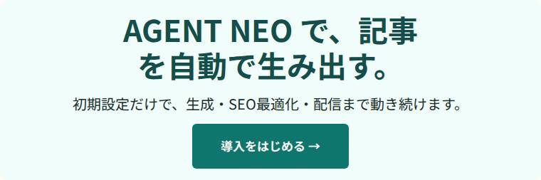

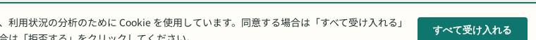

### 汎用・挿入用

| # | slug | title | block types | post types | 使用箇所 | 説明 |
|---|---|---|---|---|---|---|
| - | agent-neo/footer-credit | Footer Credit | core/paragraph | wp_template, wp_template_part | part:footer | フッターのコピーライト表記（年を自動更新）。 |
| - | agent-neo/hero | Hero セクション | core/group | page, wp_template | 挿入専用 | ページ上部に配置するヒーローセクション。見出し・説明文・CTAボタンで構成。secondary 背景・インク色テキスト・オレンジ CTA。 |

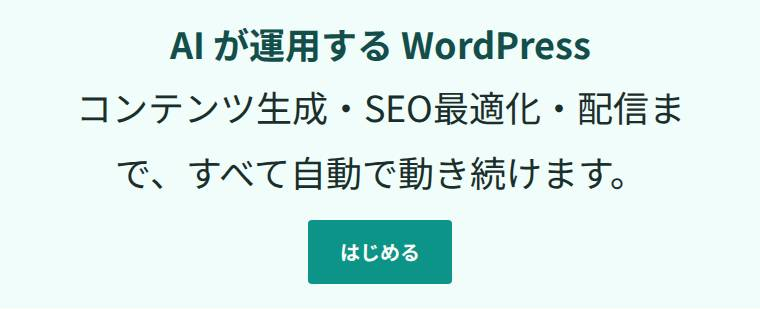

## 未整備パーツ（テーマ A / B との操作比較から）

| パーツ | 出所 | 差の中身 | 優先（仮） |
|---|---|---|---|
| 固定シェアボタン（追従サイド） | テーマB | 記事の可視領域に常駐する縦シェア。本テーマは記事末のみ。 | 高 |
| サイドバー変種（追尾・トップ専用・スマホ開閉下） | テーマB | ウィジェット領域 4 種。本テーマは子テーマの 1 種のみ。 | 高 |
| 記事内 CTA スロット（本文上・本文中・本文下） | テーマA/B | ウィジェット領域 6 箇所（A）／ブログパーツ（B）。本テーマは post-footer の 1 箇所。 | 高 |
| お知らせバー（ヘッダー直下） | テーマB | カスタマイザー 14 control。本テーマ未実装。 | 中 |
| ピックアップバナー／記事スライダー | テーマB | トップ用。本テーマは home-resources（3 件グリッド）のみ。 | 中 |
| スマホ下部固定メニュー | テーマB | 18 control。本テーマ未実装。 | 中 |
| ページトップボタン | テーマA/B（未検出だが標準装備） | 3 テーマとも DOM 未検出。低コストで足せる。 | 低 |
| PR 表記（ステマ規制） | テーマA/B | 記事冒頭の自動表記。本テーマは disclosure ブロック（plugin）で手動。 | 高 |
| FAQ／ステップ／タブ／アコーディオン | テーマA/B | 独自ブロック。本テーマは lp-faq の静的パターンのみ（開閉なし）。 | 高 |
| 吹き出し／タイムライン／比較表／レビュー星 | テーマA/B | 独自ブロック。本テーマ未実装。アフィリエイト記事の主力パーツ。 | 高 |
| ブログカード（内部リンク） | テーマA/B | 独自ブロック。core/embed のリンクプレビューで代替可だが装飾なし。 | 中 |
| ボックスメニュー／リッチメニュー | テーマA/B | アイコン付き導線グリッド。本テーマは home-gateway（3 列固定）のみ。 | 中 |
| ランキング／比較表用ボタン | テーマA | アフィリエイト向け。本テーマ未実装。 | 中 |
| LP 専用投稿タイプ／ブログパーツ（再利用部品） | テーマB | CPT 2 種。本テーマは page テンプレ + 同期パターン（wp_block）で代替可。 | 低 |
| 広告タグ管理／AB テスト | テーマB | 管理メニュー + ブロック。本テーマは HELIX 側（REQ-NF-025）で担う想定。 | 低（設計判断） |
| メインビジュアル編集 UI | テーマA/B | カスタマイザー 97〜109 control。本テーマは home-hero パターンをエディタで直接編集。 | 低（方式差） |

出典: `docs/research/2026-08-27-poc-browser-verification/theme-comparison.md`。
