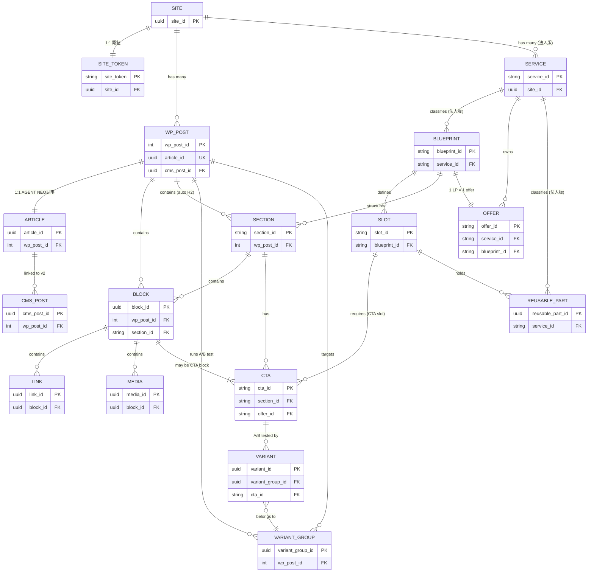

# AGENT NEO — 安定 ID 体系 定義書

> バージョン: 1.0  
> 作成日: 2026-04-30  
> 参照元: L0-planning.md / L1-requirements.md / seo-tool-v2 db_schema.md / er_like.md

---

## §1 全 ID 一覧

| # | ID 名 | 分類 | データ型 | 一意性スコープ | 永続化場所 | 不変性 | 主な REQ |
|---|-------|------|---------|--------------|------------|--------|---------|
| 1 | `site_id` | サイト識別 | UUID v4 | グローバル | v2: SITES.id | 不変 | REQ-F-027 |
| 2 | `site_token` | トラッキング認証 | opaque token (32 bytes hex) | グローバル | v2: WORDPRESS_CONNECTIONS + WP post_meta | ローテーション可 | REQ-F-027 |
| 3 | `wp_post_id` | WP 標準投稿 ID | 数値シーケンス (INT) | per-site | WP posts.ID (標準) | 不変（サイト内） | REQ-F-021, F-027 |
| 4 | `cms_post_id` | v2 生成記事 ID | UUID v4 | グローバル | v2: GENERATED_ARTICLES.id + WP post_meta `_agent_neo_cms_post_id` | 不変 | REQ-F-027 |
| 5 | `article_id` | AGENT NEO 記事 ID | UUID v4 | グローバル | WP post_meta `_agent_neo_article_id` | 不変（投稿移動・複製でも引継ぎ禁止） | REQ-F-025, F-027 |
| 6 | `block_id` | ブロック単位識別 | UUID v4 | グローバル | WP ブロック属性 `data-block-id` + post_meta JSON | 不変（コンテンツ変更で変わらない） | REQ-F-021, F-036 |
| 7 | `section_id` | H2 セクション識別 | slug `h2-{slug}-{uuid8}` | per-post（グローバル一意推奨） | WP post_meta `_agent_neo_sections` JSON + v2 WP_PAGE_SECTIONS | 不変（見出し変更で変わらない） | REQ-F-022, F-027 |
| 8 | `cta_id` | CTA ブロック識別 | slug `{context}-cta-{seq}` (例: `hero-cta-01`) | グローバル | WP post_meta JSON + ブロック属性 `data-cta-id` | 不変 | REQ-F-006, F-023, F-030, F-031 |
| 9 | `variant_id` | A/B バリアント識別 | UUID v4 | per A/B テスト | WP post_meta JSON + v2 AB_TEST_VARIANTS.id | テスト期間中不変、終了後 archive | REQ-F-024, F-027 |
| 10 | `blueprint_id` | LP/HP ブループリント識別 | slug `{type}-{name}-v{n}` (例: `lp-saas-v1`) | グローバル | reusable-part CPT post_meta | 不変（バージョン込み） | REQ-F-012, F-037, F-039 |
| 11 | `slot_id` | Blueprint slot 識別 | slug `{blueprint}-{slot-name}` (例: `lp-saas-v1-hero`) | per-blueprint | blueprint.json 内 | 不変 | REQ-F-037 |
| 12 | `link_id` | 内部リンク識別 | UUID v4 | per-post | WP ブロック属性 `data-link-id` + post_meta JSON | 不変（URL 差替え可） | REQ-F-023 |
| 13 | `banner_id` | バナーブロック識別 | slug `{context}-banner-{seq}` | グローバル | WP post_meta JSON + ブロック属性 | 不変 | REQ-F-023 |
| 14 | `media_id` | メディア（画像）識別 | UUID v4 | グローバル | WP post_meta `_agent_neo_media_id` + WP media post | 不変（WebP 差替え可） | REQ-F-017, F-023 |
| 15 | `offer_id` | LP オファー識別 | slug `{service}-offer-{name}` (例: `saas-offer-free-trial`) | グローバル | WP post_meta `_agent_neo_offer_id` | 不変 | REQ-F-012, F-031 |
| 16 | `service_id` | 法人サービス識別 | slug `service-{name}` (例: `service-crm`) | per-site | WP options `agent_neo_services` JSON | 不変 | REQ-F-012, F-031, F-035 |
| 17 | `reusable_part_id` | 再利用パーツ識別 | UUID v4 | グローバル | reusable-part CPT post ID + post_meta | 不変 | REQ-F-023, F-037 |
| 18 | `variant_group_id` | A/B テスト親グループ | UUID v4 | グローバル | WP post_meta + v2 AB_TESTS.id | テスト完了まで不変 | REQ-F-024 |

**ID 種別総数: 18 種**

---

## §2 ID 定義詳細

### 2.1 site_id

| 属性 | 内容 |
|------|------|
| ID 名 | `site_id` |
| 用途 | Automation SEO v2 上でのサイト識別。AGENT NEO インストール済みサイトを一意に表す |
| データ型 | UUID v4 |
| 一意性スコープ | グローバル（v2 全体） |
| 永続化場所 | v2: `SITES.id`（primary key）。WP 側: `wp_options` の `agent_neo_site_id` |
| 生成タイミング | Automation SEO 連携設定時（初回 `/tracking/token/{site_id}` 発行前に v2 で生成） |
| 不変性 | 完全不変。サイト URL 変更・ドメイン移転でも変わらない |
| 関連 ID | `site_token`（同サイトの認証トークン）、`wp_post_id`（当サイト内の投稿） |
| 提供 API | `GET /agent-neo/v1/site/info`、`POST /wordpress/pages/sync/{site_id}`（v2 側） |
| v2 DB 対応 | `SITES.id`（UUID PK） |

---

### 2.2 site_token

| 属性 | 内容 |
|------|------|
| ID 名 | `site_token` |
| 用途 | v2 トラッキング API への認証。フロントエンド JS から送信する公開トークン |
| データ型 | opaque token（hex 32 bytes、例: `token_abc123def456...`） |
| 一意性スコープ | グローバル（v2 全体） |
| 永続化場所 | v2: `WORDPRESS_CONNECTIONS`（connection record に紐付け）。WP 側: `wp_options` の `agent_neo_site_token`（暗号化保存） |
| 生成タイミング | `POST /tracking/token/{site_id}` で v2 が発行 |
| 不変性 | ローテーション可（旧トークンは 24 時間猶予後失効）。サイト ID とは別管理 |
| 関連 ID | `site_id`（1:1 対応）、`WORDPRESS_CONNECTIONS.id` |
| 提供 API | v2: `POST /tracking/event`（site_token 認証）、`POST /tracking/section-engagement`、`POST /tracking/context` |
| v2 DB 対応 | `WORDPRESS_CONNECTIONS.wp_site_url` レコードに付随（詳細カラムは実装側で拡張） |

---

### 2.3 wp_post_id

| 属性 | 内容 |
|------|------|
| ID 名 | `wp_post_id` |
| 用途 | WordPress 標準の投稿 ID。WP コアが自動採番。AGENT NEO は参照のみ |
| データ型 | 数値シーケンス（INT、WP 標準） |
| 一意性スコープ | per-site（サイト内グローバル） |
| 永続化場所 | `wp_posts.ID`（WP 標準テーブル） |
| 生成タイミング | WP に投稿を作成した瞬間（WP コア管理） |
| 不変性 | サイト内不変。ただし他サイトへの移行時には別 ID になる可能性あり |
| 関連 ID | `article_id`（AGENT NEO 側 UUID）、`cms_post_id`（v2 生成記事との対応） |
| 提供 API | `PATCH /agent-neo/v1/posts/<wp_post_id>/blocks/<block_id>`、`GET /agent-neo/v1/posts/<wp_post_id>` |
| v2 DB 対応 | `WP_PAGES.wp_post_id`（INT 外部参照） |

---

### 2.4 cms_post_id

| 属性 | 内容 |
|------|------|
| ID 名 | `cms_post_id` |
| 用途 | Automation SEO v2 で生成・管理された記事の ID。v2 → AGENT NEO の bidirectional マッピングに使用 |
| データ型 | UUID v4 |
| 一意性スコープ | グローバル（v2 全体） |
| 永続化場所 | v2: `GENERATED_ARTICLES.id`。WP 側: post_meta `_agent_neo_cms_post_id` |
| 生成タイミング | v2 が記事生成タスクを実行した時点 |
| 不変性 | 完全不変。WP 側の投稿 ID が変わっても cms_post_id は固定 |
| 関連 ID | `article_id`（AGENT NEO UUID）、`wp_post_id`（WP 標準 ID） |
| 提供 API | `GET /agent-neo/v1/posts?cms_post_id=<uuid>`、v2: `GET /articles/{cms_post_id}` |
| v2 DB 対応 | `GENERATED_ARTICLES.id`（UUID PK） |

---

### 2.5 article_id

| 属性 | 内容 |
|------|------|
| ID 名 | `article_id` |
| 用途 | AGENT NEO が管理する投稿の安定識別子。v2 連携・SEO 計測の外部キーとして機能 |
| データ型 | UUID v4 |
| 一意性スコープ | グローバル |
| 永続化場所 | WP post_meta `_agent_neo_article_id` |
| 生成タイミング | 投稿が AGENT NEO 経由で作成された時点（または既存投稿への AGENT NEO 初回適用時） |
| 不変性 | 完全不変。コンテンツ更新・カテゴリ変更・スラッグ変更でも変わらない |
| 関連 ID | `wp_post_id`（WP 標準）、`cms_post_id`（v2 対応）、`section_id`（記事内セクション） |
| 提供 API | v2: `POST /tracking/context`（article_id を含む）、`GET /agent-neo/v1/posts`（article_id を露出） |
| v2 DB 対応 | `WP_PAGES.id`（UUID PK）の対応関係。`SECTION_ENGAGEMENT.article_id` 相当 |

---

### 2.6 block_id

| 属性 | 内容 |
|------|------|
| ID 名 | `block_id` |
| 用途 | Gutenberg ブロック単位の安定識別子。部分更新・CSS スコーピング・rollback に使用 |
| データ型 | UUID v4 |
| 一意性スコープ | グローバル |
| 永続化場所 | WP ブロック属性 `data-block-id`（HTML 出力）+ post_meta `_agent_neo_blocks` JSON配列 |
| 生成タイミング | ブロック作成時（エディタ保存 or API 経由でブロック追加時） |
| 不変性 | コンテンツ変更（テキスト編集・スタイル変更）では変わらない。投稿複製時は**新規発行必須** |
| 関連 ID | `section_id`（block が属する H2 セクション）、`cta_id`（CTA ブロックは cta_id も保持）、`wp_post_id`（親投稿） |
| 提供 API | `PATCH /agent-neo/v1/posts/<id>/blocks/<block_id>`、CSS スコープ `.agent-neo-ai-block-{block_id}` |
| v2 DB 対応 | `WP_PAGE_SECTIONS` に block レベルの行として格納（section_id 管下） |

---

### 2.7 section_id

| 属性 | 内容 |
|------|------|
| ID 名 | `section_id` |
| 用途 | H2 セクション（H2 から次 H2 まで）の安定識別子。LLM 編集・エンゲージメント計測の基本単位 |
| データ型 | slug `h2-{kebab-slug}-{uuid8}` (例: `h2-seo-basics-a1b2c3d4`) |
| 一意性スコープ | グローバル推奨（最低でも per-site 一意） |
| 永続化場所 | WP post_meta `_agent_neo_sections` JSON + HTML `data-agent-section-id` 属性 + v2 `WP_PAGE_SECTIONS`（`section_id` カラム） |
| 生成タイミング | 投稿保存時に H2 を自動検出して付与（auto-section_id）。初回付与後は見出し変更でも維持 |
| 不変性 | 見出しテキスト変更・順序変更でも変わらない。削除・再追加時のみ新規発行 |
| 関連 ID | `article_id` / `wp_post_id`（親投稿）、`block_id`（セクション内のブロック群）、`cta_id`（セクション内 CTA） |
| 提供 API | `POST /agent-neo/v1/posts/<id>/sections/<section_id>/edit`、v2: `WP_PAGE_SECTIONS` へ同期 |
| v2 DB 対応 | `WP_PAGE_SECTIONS`（section_id カラム: VARCHAR(100)）、`SECTION_METRICS_DAILY`（wp_page_id 経由で集計）、`SECTION_ENGAGEMENT.section_id` |

---

### 2.8 cta_id

| 属性 | 内容 |
|------|------|
| ID 名 | `cta_id` |
| 用途 | CTA ブロック・要素の安定識別子。Element Swap・A/B テスト・CV 計測の基本キー |
| データ型 | slug `{context}-cta-{seq}` (例: `hero-cta-01`、`sidebar-cta-02`) |
| 一意性スコープ | グローバル（サイト全体で一意） |
| 永続化場所 | WP ブロック属性 `data-cta-id` + post_meta JSON + v2 TRACKING_EVENTS.data(jsonb) |
| 生成タイミング | CTA ブロック作成時（人間可読 slug を管理画面で設定、未設定時は自動生成） |
| 不変性 | 完全不変。CTA テキスト・色変更でも維持。AI による変更禁止（システム保護属性） |
| 関連 ID | `section_id`（配置セクション）、`variant_id`（A/B バリアント）、`offer_id`（紐付けオファー）、`blueprint_id`（LP 内 slot） |
| 提供 API | Element Swap: `POST /agent-neo/v1/swap/cta`（`from_cta_id`, `to_cta_id`）、REQ-F-006/023/030/031 |
| v2 DB 対応 | `TRACKING_EVENTS.data`（jsonb）に `cta_id` フィールドとして保存 |

---

### 2.9 variant_id

| 属性 | 内容 |
|------|------|
| ID 名 | `variant_id` |
| 用途 | A/B テストの各バリアント識別子。配信制御・impression/click/CV 計測・統計判定に使用 |
| データ型 | UUID v4 |
| 一意性スコープ | グローバル |
| 永続化場所 | WP post_meta `_agent_neo_ab_variants` JSON + v2 `AB_TEST_VARIANTS.id` |
| 生成タイミング | A/B テスト作成時に Automation SEO 側 LLM が variant 候補を生成した時点 |
| 不変性 | テスト期間中は不変。テスト終了後（勝者昇格 / loser archive）に無効化 |
| 所有責務 | AGENT NEO は variant 生成 API を持たず、受け取った variant を保存・配信・計測紐付けのみ実施する |
| 関連 ID | `variant_group_id`（親 A/B テスト）、`cta_id`（variant が差替える CTA）、`section_id`（variant が属するセクション） |
| 提供 API | `POST /agent-neo/v1/posts/<id>/ab-test/start`、`wp agent-neo ab-test stop --post_id=X`（variant_id で計測ログを保持） |
| v2 DB 対応 | `AB_TEST_VARIANTS.id`（UUID PK）。`TRACKING_EVENTS.data.variant_id` でイベント紐付け |

---

### 2.10 blueprint_id

| 属性 | 内容 |
|------|------|
| ID 名 | `blueprint_id` |
| 用途 | LP/HP/BLP ブループリント全体の識別子。Element Swap でブループリント全体差替えに使用 |
| データ型 | slug `{type}-{name}-v{n}` (例: `lp-saas-v1`、`hp-corporate-v2`) |
| 一意性スコープ | グローバル |
| 永続化場所 | reusable-part CPT（カスタム投稿タイプ）の post_meta `_agent_neo_blueprint_id` |
| 生成タイミング | ブループリント初回作成時（または既存 blueprint のバージョンアップ時に新 ID） |
| 不変性 | バージョン込みのため実質不変。更新は新バージョン（`-v2` 等）として別 ID 発行 |
| 関連 ID | `slot_id`（blueprint 内の named slot）、`offer_id`（LP の主要オファー）、`service_id`（法人版サービス分類） |
| 提供 API | `GET /agent-neo/v1/blueprints`、`POST /agent-neo/v1/swap/blueprint`、REQ-F-012/037/039 |
| v2 DB 対応 | v2 に直接テーブルなし。v2 Tier 2 サンドボックスでは `WP_PAGES` に blueprint_id を post_meta 経由で保持 |

---

### 2.11 slot_id

| 属性 | 内容 |
|------|------|
| ID 名 | `slot_id` |
| 用途 | Blueprint 内の named slot 識別子。AI 編集領域の制限と `required_attributes` 強制に使用 |
| データ型 | slug `{blueprint_id}-{slot-name}` (例: `lp-saas-v1-hero`、`lp-saas-v1-cta`) |
| 一意性スコープ | per-blueprint |
| 永続化場所 | `blueprint.json` 内（reusable-part CPT の post_meta 内 JSON） |
| 生成タイミング | blueprint 設計時に静的定義 |
| 不変性 | blueprint のマイナーバージョン内は不変。メジャー変更時は blueprint_id ごと更新 |
| 関連 ID | `blueprint_id`（親）、`cta_id`（CTA slot に必須）、`block_id`（slot 内のブロック群） |
| 提供 API | blueprint.json の `slots[]` 配列として露出。REQ-F-037 |
| v2 DB 対応 | v2 DB には直接対応なし（blueprint.json 内の内部構造） |

---

### 2.12 link_id

| 属性 | 内容 |
|------|------|
| ID 名 | `link_id` |
| 用途 | 内部リンク要素の安定識別子。テキスト保持・URL のみ差替え（Element Swap）に使用 |
| データ型 | UUID v4 |
| 一意性スコープ | グローバル |
| 永続化場所 | WP ブロック属性 `data-link-id` + post_meta JSON |
| 生成タイミング | 内部リンク要素の初回作成時 |
| 不変性 | リンクテキスト変更・URL 変更でも変わらない |
| 関連 ID | `block_id`（含むブロック）、`section_id`（含むセクション） |
| 提供 API | `POST /agent-neo/v1/swap/link`（`link_id`, `new_url`）。REQ-F-023 |
| v2 DB 対応 | `TRACKING_EVENTS.data`（jsonb）に `link_id` フィールドとして保存 |

---

### 2.13 banner_id

| 属性 | 内容 |
|------|------|
| ID 名 | `banner_id` |
| 用途 | バナーブロック識別子。バナー全体の差替え（Element Swap）に使用 |
| データ型 | slug `{context}-banner-{seq}` (例: `sidebar-banner-01`) |
| 一意性スコープ | グローバル |
| 永続化場所 | WP ブロック属性 `data-banner-id` + post_meta JSON |
| 生成タイミング | バナーブロック作成時 |
| 不変性 | バナー画像・テキスト変更でも変わらない |
| 関連 ID | `block_id`（対応ブロック）、`cta_id`（バナー内 CTA）、`section_id` |
| 提供 API | `POST /agent-neo/v1/swap/banner`（`banner_id`, `new_banner_id`）。REQ-F-023 |
| v2 DB 対応 | `TRACKING_EVENTS.data`（jsonb）の `banner_id` フィールド |

---

### 2.14 media_id

| 属性 | 内容 |
|------|------|
| ID 名 | `media_id` |
| 用途 | 画像メディアの安定識別子。WebP/JPEG ペアの `<picture>` 差替えに使用 |
| データ型 | UUID v4 |
| 一意性スコープ | グローバル |
| 永続化場所 | WP post_meta `_agent_neo_media_id`（メディア投稿に付与） |
| 生成タイミング | `POST /agent-neo/v1/media/upload` 経由でアップロードされた時点 |
| 不変性 | 完全不変。WebP 再生成・リサイズでも変わらない |
| 関連 ID | `block_id`（画像を含むブロック）、`wp_post_id`（WP メディア投稿 ID） |
| 提供 API | `POST /agent-neo/v1/media/upload`、`POST /agent-neo/v1/swap/media`。REQ-F-017/023 |
| v2 DB 対応 | v2 DB には直接対応なし（WP メディアライブラリに委譲） |

---

### 2.15 offer_id

| 属性 | 内容 |
|------|------|
| ID 名 | `offer_id` |
| 用途 | LP の主要オファー識別子。1 LP に 1 offer_id を必須化。CV 計測の基本単位 |
| データ型 | slug `{service}-offer-{name}` (例: `saas-offer-free-trial`、`corp-offer-demo`) |
| 一意性スコープ | グローバル |
| 永続化場所 | WP post_meta `_agent_neo_offer_id` |
| 生成タイミング | LP ブループリント作成時または既存 LP への AGENT NEO 初回適用時 |
| 不変性 | キャンペーン期間変更・価格変更でも変わらない。終了後は archive（削除禁止） |
| 関連 ID | `blueprint_id`（LP 全体）、`cta_id`（オファーへの CTA）、`service_id`（紐付けサービス）、`variant_id`（A/B バリアント） |
| 提供 API | `GET /agent-neo/v1/blueprints/{blueprint_id}/offer`。REQ-F-012/031 |
| v2 DB 対応 | `TRACKING_EVENTS.data.offer_id`（jsonb）でイベント計測 |

---

### 2.16 service_id

| 属性 | 内容 |
|------|------|
| ID 名 | `service_id` |
| 用途 | 法人版の複数サービス識別子。service-aware IA でコンテンツをサービス別に分類・送客 |
| データ型 | slug `service-{name}` (例: `service-crm`、`service-analytics`) |
| 一意性スコープ | per-site |
| 永続化場所 | WP options `agent_neo_services`（JSON 配列）+ 各コンテンツ post_meta `_agent_neo_service_id` |
| 生成タイミング | 法人版管理画面でサービスを登録した時点 |
| 不変性 | サービス名称変更・説明変更でも変わらない（スラッグは永続） |
| 関連 ID | `offer_id`（サービスのオファー）、`blueprint_id`（サービス別 LP）、`cta_id`（サービス別 CTA）、`reusable_part_id`（サービス別パーツ） |
| 提供 API | `GET /agent-neo/v1/services`、LP/HP 生成時の必須パラメータ。REQ-F-012/031/035 |
| v2 DB 対応 | v2 DB には直接対応なし。v2 側では `SITES.settings`（jsonb）内の service 定義として管理 |

---

### 2.17 reusable_part_id

| 属性 | 内容 |
|------|------|
| ID 名 | `reusable_part_id` |
| 用途 | 法人版再利用パーツ（フリーフォーム HTML/CSS ブロック等）の識別子。承認 gate 経由で再利用 |
| データ型 | UUID v4 |
| 一意性スコープ | グローバル |
| 永続化場所 | reusable-part CPT（`post_type: agent-neo-part`）の post_meta `_agent_neo_part_id` |
| 生成タイミング | reusable-part CPT 投稿作成時（AI フリーフォーム保存 or 手動登録時） |
| 不変性 | 完全不変。パーツ内容更新は version 管理（UUID は変えず version カウンタを増加） |
| 関連 ID | `service_id`（法人版: サービス分類）、`blueprint_id`（LP に埋め込まれる場合）、`slot_id`（割り当て先 slot） |
| 提供 API | `GET /agent-neo/v1/reusable-parts`、`POST /agent-neo/v1/swap/reusable-part`。REQ-F-023/035/037 |
| v2 DB 対応 | v2 DB には直接対応なし（WP CPT に委譲） |

---

### 2.18 variant_group_id

| 属性 | 内容 |
|------|------|
| ID 名 | `variant_group_id` |
| 用途 | A/B テストのグループ（実験）識別子。複数 variant_id を束ねる親 ID |
| データ型 | UUID v4 |
| 一意性スコープ | グローバル |
| 永続化場所 | WP post_meta `_agent_neo_ab_test` JSON + v2 `AB_TESTS.id` |
| 生成タイミング | A/B テスト開始時（`POST /agent-neo/v1/posts/<id>/ab-test/start`） |
| 不変性 | テスト完了（勝者昇格）後も archive として保持（削除不可・計測ログ保護） |
| 関連 ID | `variant_id`（子: テスト内の各バリアント）、`wp_post_id`（テスト対象投稿）、`cta_id`（テスト対象 CTA） |
| 提供 API | `GET /agent-neo/v1/posts/<id>/ab-test/status`。REQ-F-024 |
| v2 DB 対応 | `AB_TESTS.id`（UUID PK）、`AB_TESTS.status` |

---

## §3 関係図（Mermaid）



---

## §4 一意性ルール

### R-01: block_id のグローバル一意性
- **ルール**: 同じ `block_id` が異なる post に存在してはならない（グローバル一意）
- **理由**: PATCH API は `block_id` を主キーとするため、サイト内衝突でも誤操作リスク
- **実装**: UUID v4 生成で確率的に保証。DB にユニーク制約（post_meta JSON の index または custom table）

### R-02: 投稿複製時の block_id 再発行
- **ルール**: 投稿を複製（Duplicate Post 等）した場合、複製先の全 block_id は**必ず新規 UUID を発行**
- **理由**: 複製元と複製先が同一 `block_id` を持つと、PATCH API が意図しない投稿を更新する
- **実装**: `wp_post_duplicate` フック等で block_id を一括再生成する後処理を必須実装

### R-03: section_id のグローバル一意性
- **ルール**: `section_id` はグローバル一意を推奨。`h2-{slug}-{uuid8}` 形式で衝突確率を最小化
- **理由**: v2 `WP_PAGE_SECTIONS` でクロスサイト集計する際に site_id との複合キーが必要になるが、グローバル一意なら JOIN が単純化される
- **例外**: 最低ラインは per-site 一意。複数サイト管理なら site_id との複合 UNIQUE 制約

### R-04: 外部サイトから取り込んだ block_id の扱い
- **ルール**: Migration Plugin（移行ツール）で外部サイトから取り込んだ block は**元の block_id を破棄し新規発行**
- **理由**: 外部 UUID は AGENT NEO 側の UUID 空間で衝突する可能性があり、グローバル一意性を壊す
- **例外**: 自社サイト間の意図的な移行かつ UUID 衝突がないと確認できる場合のみ、元 ID 引継ぎを許可（管理者フラグ必須）

### R-05: A/B バリアントの block_id 共有禁止
- **ルール**: A/B テストの variant ブロックは元ブロックとは**別の block_id** を持つ
- **理由**: 元ブロックと variant ブロックを PATCH で独立して更新するため
- **補足**: variant ブロックは `variant_id` で元ブロックとの関係を表現する（block_id の親子関係ではなく variant_id で紐付け）

### R-06: cta_id の AI 変更禁止
- **ルール**: `cta_id` / `section_id` / `variant_id` の 3 属性は AI による書き換えを禁止する（システム保護属性）
- **実装**: REQ-F-036 の検証パイプライン（anchor 属性保護ステップ）で強制。違反時は apply ブロック

### R-07: offer_id の削除禁止
- **ルール**: `offer_id` は計測データの外部キーとなるため削除不可。終了後は `status: archived` に移行
- **理由**: 過去の CV イベントが offer_id を参照しており、削除すると計測データが孤立する

### R-08: variant_group_id の完了後保持
- **ルール**: A/B テスト完了（`wp agent-neo ab-test stop`）後も `variant_group_id` と関連計測ログは保持
- **実装**: soft delete のみ許可。`status: stopped | winner_selected | archived` で状態管理

### R-09: slug 系 ID の文字規則
- **ルール**: slug 型 ID（`cta_id`、`service_id`、`offer_id`、`banner_id`、`blueprint_id`、`slot_id`）は以下の形式に従う
  - 使用文字: `[a-z0-9-]`（小文字英数字とハイフン）
  - 先頭・末尾: ハイフン禁止
  - 最大長: 128 文字
  - 変更禁止: 一度設定した slug は変更禁止（URL / セレクタへの影響を避けるため）

---

## §5 生成方針

### 5.1 UUID v4 推奨 ID（システム生成・機械管理）

以下の ID は UUID v4 を採用する:

| ID | 理由 |
|----|------|
| `site_id` | v2 との整合性（v2 SITES.id が UUID） |
| `cms_post_id` | v2 GENERATED_ARTICLES.id と 1:1 対応 |
| `article_id` | コンテンツ移動・複製耐性、グローバル一意必須 |
| `block_id` | グローバル一意必須、PATCH API の主キー |
| `link_id` | ブロック内の細粒度 ID、自動生成が自然 |
| `media_id` | WP メディア投稿との対応（自動生成） |
| `variant_id` | Automation SEO 側 LLM が自動生成するバリアント |
| `variant_group_id` | A/B テスト実験の一意識別（自動生成） |
| `reusable_part_id` | CPT 登録時に自動生成 |

**生成コード例** (PHP):
```php
$block_id = wp_generate_uuid4(); // WP コア関数
```

### 5.2 人間可読 slug 推奨 ID（人間設定・管理画面）

以下の ID は人間可読の slug を採用する:

| ID | フォーマット | 例 | 理由 |
|----|------------|-----|------|
| `section_id` | `h2-{slug}-{uuid8}` | `h2-seo-basics-a1b2c3d4` | SEO anchor・デバッグの可読性、末尾 uuid8 で衝突回避 |
| `cta_id` | `{context}-cta-{seq}` | `hero-cta-01` | 管理画面・ログでの視認性、AI が「hero-cta-01 の CTR が低い」と報告できる |
| `banner_id` | `{context}-banner-{seq}` | `sidebar-banner-01` | cta_id と同じ理由 |
| `blueprint_id` | `{type}-{name}-v{n}` | `lp-saas-v1` | バージョン管理の明示性 |
| `slot_id` | `{blueprint_id}-{slot-name}` | `lp-saas-v1-hero` | blueprint との親子関係が名前から明確 |
| `offer_id` | `{service}-offer-{name}` | `saas-offer-free-trial` | LP 管理画面での視認性 |
| `service_id` | `service-{name}` | `service-crm` | 法人管理者が設定するため可読性優先 |

**slug 自動生成ルール**（未設定時のフォールバック）:
```php
// section_id の例
$heading_slug = sanitize_title( $heading_text ); // "SEO 基礎" → "seo-基礎"
$uuid8 = substr( wp_generate_uuid4(), 0, 8 );
$section_id = "h2-{$heading_slug}-{$uuid8}";
```

### 5.3 WP 標準委譲 ID

| ID | 方針 |
|----|------|
| `wp_post_id` | WP コアの `posts.ID` 自動採番をそのまま使用。AGENT NEO は参照のみ |
| `site_token` | v2 が発行する opaque token。AGENT NEO は受け取り・暗号化保存のみ |

---

## §6 v2 連携時のマッピング

### 6.1 v2 テーブルと AGENT NEO ID の対応表

| v2 テーブル | v2 カラム | AGENT NEO ID | WP 側保存場所 |
|-----------|---------|-------------|-------------|
| `SITES` | `id` (UUID PK) | `site_id` | `wp_options.agent_neo_site_id` |
| `WORDPRESS_CONNECTIONS` | `id` (UUID PK) | 内部 connection ID | `wp_options.agent_neo_connection_id` |
| `WORDPRESS_CONNECTIONS` | `wp_site_url` | - | `wp_options.siteurl` |
| `WP_PAGES` | `id` (UUID PK) | `article_id` | `post_meta._agent_neo_article_id` |
| `WP_PAGES` | `wp_post_id` (INT) | `wp_post_id` | `wp_posts.ID` |
| `WP_PAGE_SECTIONS` | `section_id` (VARCHAR 100) | `section_id` | `post_meta._agent_neo_sections[].id` |
| `SECTION_METRICS_DAILY` | `wp_page_id` (FK → WP_PAGES) | `article_id` 経由 | `post_meta._agent_neo_article_id` |
| `GENERATED_ARTICLES` | `id` (UUID PK) | `cms_post_id` | `post_meta._agent_neo_cms_post_id` |
| `TRACKING_EVENTS` | `data` (jsonb) `.article_id` | `article_id` | イベント送信時に付与 |
| `TRACKING_EVENTS` | `data` (jsonb) `.section_id` | `section_id` | イベント送信時に付与 |
| `TRACKING_EVENTS` | `data` (jsonb) `.cta_id` | `cta_id` | イベント送信時に付与 |
| `TRACKING_EVENTS` | `data` (jsonb) `.variant_id` | `variant_id` | A/B テスト時に付与 |
| `AB_TESTS` | `id` (UUID PK) | `variant_group_id` | `post_meta._agent_neo_ab_test.group_id` |
| `AB_TEST_VARIANTS` | `id` (UUID PK) | `variant_id` | `post_meta._agent_neo_ab_variants[].id` |
| `SECTION_ENGAGEMENT` | `section_id` (VARCHAR 100) | `section_id` | - |

### 6.2 v2 同期 API でのペイロード例

```json
// POST /wordpress/pages/sync/{site_id} （v2 側エンドポイント）
// AGENT NEO → v2 への同期データ
{
  "site_id": "uuid-site",
  "wp_post_id": 42,
  "article_id": "uuid-article",
  "cms_post_id": "uuid-cms-post-or-null",
  "url": "https://example.com/seo-tips/",
  "sections": [
    {
      "section_id": "h2-seo-basics-a1b2c3d4",
      "section_type": "h2",
      "heading": "SEO の基礎",
      "order": 1,
      "cta_id": "hero-cta-01"
    }
  ]
}
```

### 6.3 計測イベントでの ID 連鎖例

```json
// POST /tracking/context（フロントエンド JS → v2）
{
  "site_token": "token_abc123...",
  "url": "https://example.com/seo-tips/",
  "sections": [
    {
      "section_id": "h2-seo-basics-a1b2c3d4",
      "article_id": "uuid-article",
      "cta_id": "hero-cta-01",
      "variant_id": "uuid-variant-or-null"
    }
  ]
}
```

### 6.4 AGENT NEO が必ず post_meta で露出すべき ID

REQ-F-027 の要求に従い、以下の ID は全 AGENT NEO 投稿の post_meta として必ず露出する:

| post_meta キー | 値 | 必須条件 |
|--------------|-----|---------|
| `_agent_neo_article_id` | UUID v4 | 常時必須 |
| `_agent_neo_site_token` | opaque token（暗号化） | v2 連携時必須 |
| `_agent_neo_cms_post_id` | UUID v4 or null | v2 生成記事のみ |
| `_agent_neo_sections` | JSON 配列（section_id 含む） | AGENT NEO 管理投稿全て |
| `_agent_neo_offer_id` | slug or null | LP/HP のみ必須 |
| `_agent_neo_service_id` | slug or null | 法人版 LP/HP のみ必須 |
